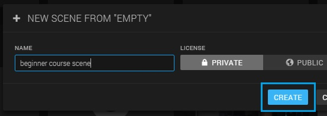
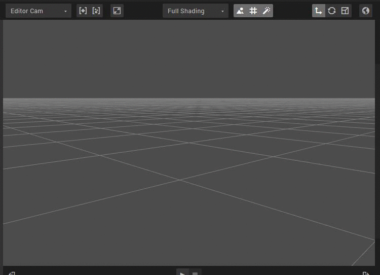
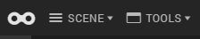
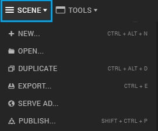
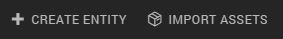
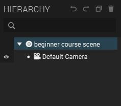
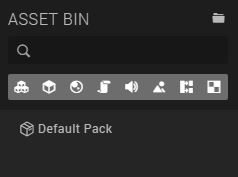

# Short introduction to Goo Create

## Creating a new scene

1. The first thing you have to do is log into Goo Create. After you logged into Goo Create, you will enter the Dashboard
2. Below *Create from template*, click on *Empty* to open an empty scene:

3. Fill in a name for your scene, for instance 'beginner course scene', and click on the *Create* button

## The Goo interface

You've now entered Goo Create. As you can see, there are several panels and buttons. We will give a short explanation of the most important components of the interface.

### The canvas

First of all, the canvas. Here you can navigate, inspect and preview the contents of your scene. You can change the point of view of the camera by pressing your right mouse button on the canvas and drag the mouse, like this:

You can zoom in and out by using the scroll on your mouse.

### Topbar

We will start at the left part of the topbar:

If you click on *scene*, a dropdown menu will expand.

From there you can do things like creating a new scene, opening an existing scene or publish your scene when it's finished.

In the center of the topbar you'll find the buttons for creating entities (the components your 3D scene exists out) and importing assets.

### Hierarchy panel

The hierarchy panel is located at the right side of the panel, and here you can find all the entities that you've added to your scene.

Because we've just created a new scene, the 'Default camera' is the only entity in your scene, and therefore the only entity in your hierarchy.

### Asset Bin

The Asset Bin is located below the Hierarchy panel.

All the files that you import and create while working on your scene can be found in the Asset Bin. Why it's useful will be clear at the end of this course.

### Inspector panel

The inspector panel is the panel on the left. When you select an entity in the hierarchy panel, you can change the settings of that entity in the inspector panel. Try it by clicking the 'Default camera' entity in the hierarchy panel. You will see that the content of the Inspector panel changes.

