## Creating the Moon surface

For the Moon surface, we are going to use the *disk* entity.

1. Click on *Create entity* at the top center of the canvas
2. Click on the disk below *3D Primitives*
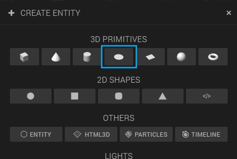
3. Rename the disk entity to 'Moon surface'
4. Add the following transformation values to the disk:
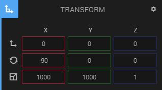

Now there should be a large disk around your moon station.

## Adding light to the scene

As you can see, the scene is pretty dark right now. Let's add some light!

There are different types of light you can use in Create. The one we are going to use for this course is the *Point* light, which lights a sphere shaped area around the light. We use this type of light, because then it will look like the moon surface is spherical, due to the range of the light, like this:
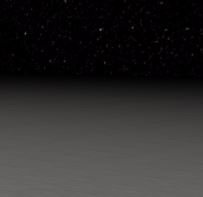

1. Click on *Create entity* at the top center of the canvas
2. Click on *Point* below *Lights*
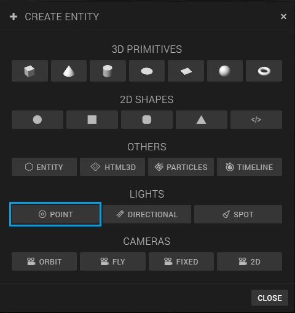
3. Change the *Y translation* of the light to '365':
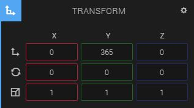

You will notice that the light isn't visible in the scene anymore. That's because we've putted it very high, and the light simply can't reach the Moon station and the Moon surface.
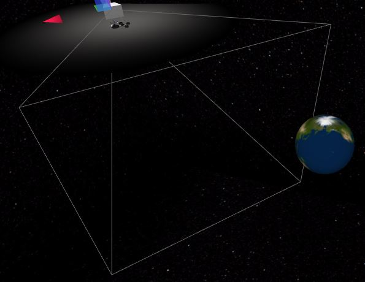

So, we have to change the range and intensity of the light. We also have to change the *specular*, because otherwise the materials would reflect to much.

4. Make sure the light entity you just added is selected in the hierarchy panel and unfold the *Light* component below the *transform* component in the inspector panel
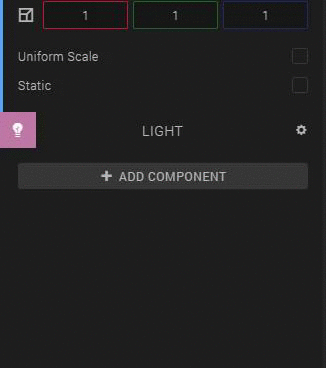
5. Change the *intensity* to '2', the *specular* to '0.1' and the *range* to '600', like this:
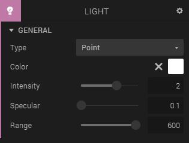

Nice, we've got light in our scene!

## Creating the Earth

For the Earth we are going to use a *sphere* entity.

1. Click on *Create Entity* and go for the *Sphere* entity under *3D Primitives*
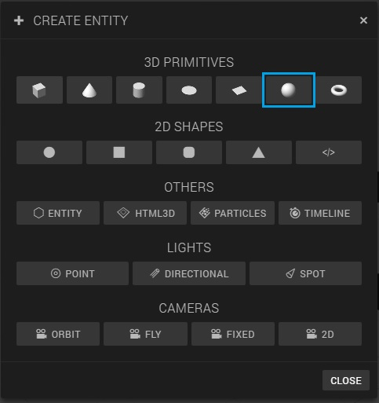
2. Change the name of the sphere to 'Earth'
3. Change the transform values of the Earth to the following:
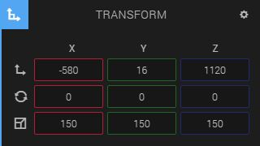

Your scene should now look like this:
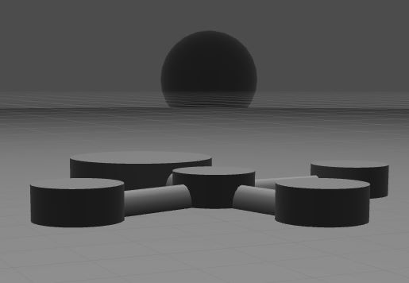

## Change clipping plane of the camera

We only have one small problem now, and that is when we put the scene in play mode by pressing the play button at the center bottom of the canvas, the earth will disappear because the camera's view frustum can't reach it.

To change the range of how far you can look with a camera, you have to change the *clipping plane* of the camera.

1. Select the *Default camera* entity in the Hierarchy panel
2. Unfold the *Camera* component below the *Transform* component in the inspector panel
3. Unfold *Clipping plane*
4. Change the value of *Far* to 1500
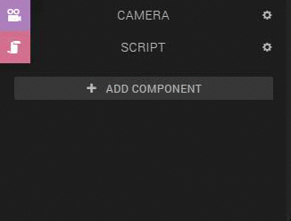

Now the Earth is visible in play mode.
