# Adding the Moon Lander

1. Open the *Asset Library* by clicking on the *Import Assets* button next to the *Create Entity* button at the top center of the canvas
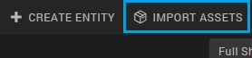
2. Type 'moon' in the search box in the top right corner
3. Double click on the 'Moon Lander'
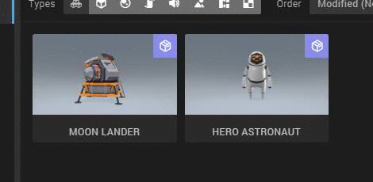
4. The Moon Lander is now added to your *Asset Bin* that is located under the *Hierarchy panel*. Drag and drop the Moon Lander entity from the *Asset bin* to the Canvas, like this:
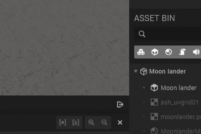

You'll see that the Moon Lander now appeared in the *Hierarchy panel*

1. Make sure the Moon Lander is selected
2. Change the transform values to the following:

It could be that the Moon Lander gets in the way of your Moon station, depending on how you placed your Moon station. Also, it looks the best when the satellite platform is on the right of the You can fix this by:

1. Selecting the *Moon station* entity in the *Hierarchy panel*
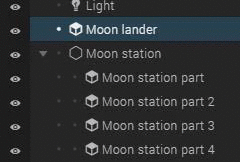
2. Click the rotate icon at the top right corner of the canvas.
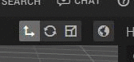
3. Rotate the Moon station by dragging the green circle, until the satellite platform is on the right side of the Moon Lander
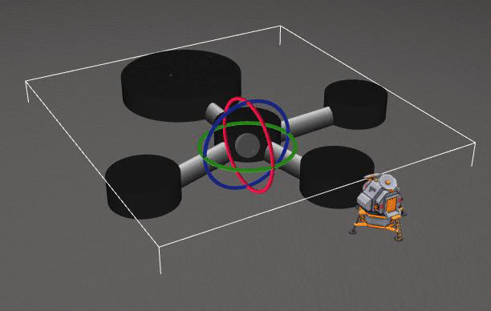

# Adding the Astronaut

1. Open the *Asset Library* by clicking on the *Import Assets* button next to the *Create Entity* button at the top center of the canvas

2. Type 'astronaut' in the search box in the top right corner
3. Double-click the 'Hero Astronaut' asset
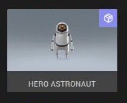
4. Drag the Hero Astronaut entity to the canvas
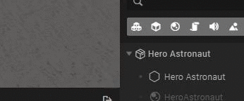
5. Change the translation of the *Astronaut* entity to the following:
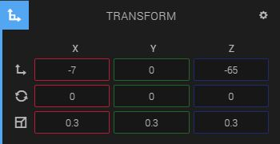

# Adding the satellite

1. Open the *Asset Library*
2. Search for Satellite and add the satellite by double-clicking it
3. Drag the Satellite entity from the asset bin to the canvas
4. Add the following translation to the satellite:

5. Click the translate button in the top right corner of the canvas
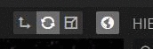
6. Drag the Y and Z arrows to put the satellite in the right position
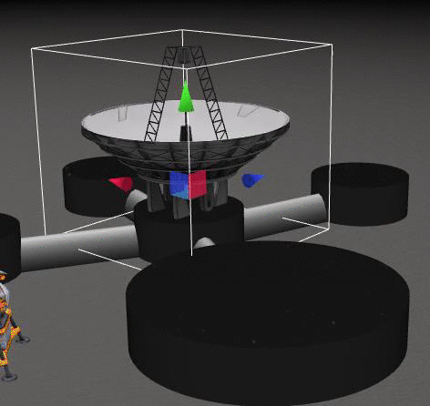

# Adding the flag

1. Open the *Asset Library*
2. Search for 'animated flag' and add the flag by double-clicking it
3. Drag the flag entity from the asset bin to the canvas
4. Add the following translation to the flag:
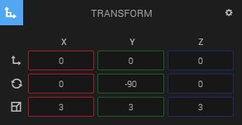
5. Drag the flag to a good location

You can see that the flag is really dark. This is because the light source is located exactly above the flag, and the flag is flat, the flag won't receive any light. We're going to apply the same fix for this as we did to the Earth entity, namely set the ambient color to white.

1. Unfold the 'Flag' entity in the *Hierarchy panel* and select the 'Flag' entity
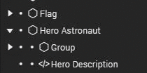
2. Unfold *Ambient* in the *Material Component*
3. Set the color to white

When you press the play button at the bottom center of the canvas, you can see that the flag is waving. This isn't very realistic, because there is no wind at the Moon. Turn the animation off by:

1. Unfolding the *Animation component* In the *Inspector panel*
2. Click the 'x' next to *default* to delete the animation state
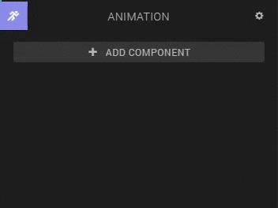

You can replace the Swedish flag with a picture of for instance the flag of your own country by:

1. Unfolding *Color (Diffuse)* in the *Material Component*
2. Drag and dropping your own image in the box where you can find the Swedish flag right now
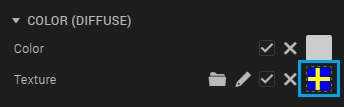

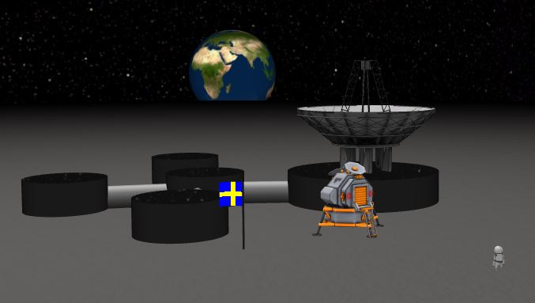
