# Add a fixed camera

Before animating the Moon rocket we're going to add a *Fixed camera*. Right now you can move the camera in the scene in playmode (when you've pressed the play button) by holding the left or right mouse button and dragging the mouse. With a fixed camera this is disabled, so it isn't possible for the user to move the camera position.

1. Click the *Create entity* button at the top center of the canvas
2. Click the *Fixed camera* in the *Create entity* window
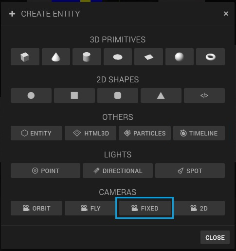
3. Add the following transform values to the Fixed Camera entity
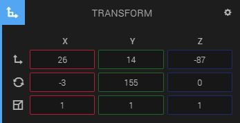
4. Unfold *Camera* below *Transform* in the *Inspector panel*
5. Check *Main camera* to view the scene through this camera when in playmod
7. Change the *FOV (field of view)* to '65'
6. Change the clipping planes from '1000' to '1500', otherwise the Earth won't be visible
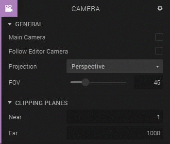

# What is the Timeline component

The Timeline Component enables you to animate properties of an entity over time, such as the scale, rotation and the translation properties.

For instance, we want to launch the rocket. As you probably know by now, to move entities we use the translation property. When the initial *Y translation* is 0, and we set the *Y translation* to '100' at 5 seconds in the timeline, the rocket will move from 0 to 100 in 5 seconds.

# Adding the timeline component

1. Click the *Create entity* button at the top center of the canvas
2. Click the *Timeline* in the *Create entity* window
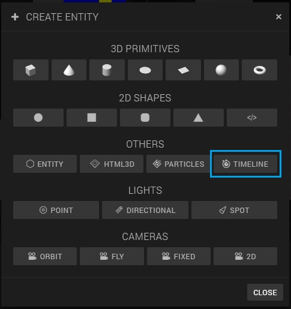

Now there should be a *Timeline entity* in your *Hierarchy panel*:
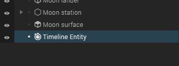

# Launching the rocket with the timeline

## Opening the timeline

1. Make sure the *Timeline entity* is selected in the *Hierarchy panel*
2. Click *Toggle timeline* in the *Inspector panel*
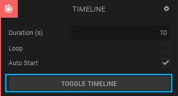

The timeline should now be visible below the canvas

## Enable to edit the Moon Lander with the timeline

To animate the transform properties of an entity, we first have to drag and drop the entity you want to animate from the *Hierarchy panel* into the *Timeline*

1. Drag and drop the *Moon lander* entity from the *Hierarchy panel* into the *Timeline*
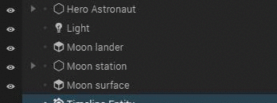
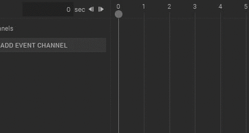

Your timeline should now look like this:
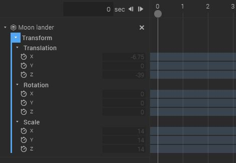

## Creating the Moon lander animation

To make the Moon lander go up, we have to edit the *Y translation* in the timeline

1. To enable the *Y translation* to be edited, press the little clock in front of the *Y* under *Translation*
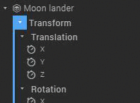
2. Drag the *playhead* to 5 seconds by dragging and dropping the little circle
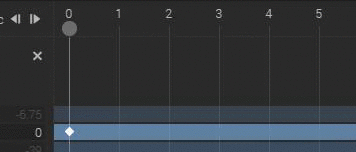
3. Change the *Translate Y* value from '0' to '220'
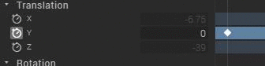
There should appear a keyframe for the *Y translation* at 5 seconds
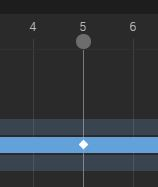

Press the *Play button* to check out what happens!

As you can see, the animation isn't very realistic because a real rocket moves really slow at first and then gradually goes faster. To create this, we have to add an *easing* to the animation.

1. Right-click the first *Y translation* key frame, so the one at 0 seconds
2. Change the *Easing function* from 'Linear' to 'Cubic'
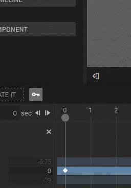

Looks much better now, don't you think?

# Creating the Camera animation

When the rocket launches we want the camera to move up as well.

1. Drag the *Fixed camera* entity into the *Timeline*, as you did with the Moon Lander entity
2. Scroll down in the timeline untill you see the Transform options for the *Fixed cam* entity
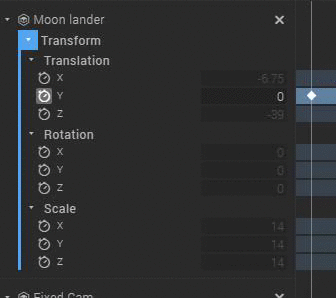
3. Enable the *Y translation* in the *Timeline*
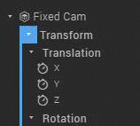
4. Drag the playhead to **6** seconds
5. Change the *Y translation* value from '14' to '166'

6. Right-click the first keyframe, so the one at 0 seconds, and set the *Easing function* to 'Cubic' and the *Easing type* to 'In - Out'
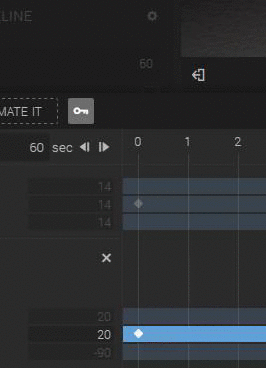

# Start animation when Moon Rocket is clicked

Because we don't want the animation to start right after the scene is loaded, we're going to add a *state machine* to the Moon Rocket and to the timeline that starts the timeline when the Moon Rocket is clicked.

There is a *Start Timeline* action, but to use it your *timeline* has to be in the same entity as the *state machine* itself. So, we have to add a state machine to the *Timeline entity* as well, and send a message from the *Moon Lander* state machine to the *Timeline* state machine to use the *Start timeline* action.

For sending messages you can use the *Emit message* action, and for receiving the *Listen* action.

## Send message to timeline entity

1. Make sure the *Timeline* entity is selected and uncheck *Auto start* in the *Inspector panel*
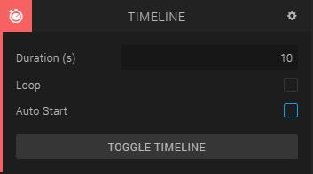
2. Select the *Moon lander* entity in the *Hierarchy panel*
3. Add a *State machine component* in the *Inspector panel*
4. Create and edit a new behavior by pressing the *+*
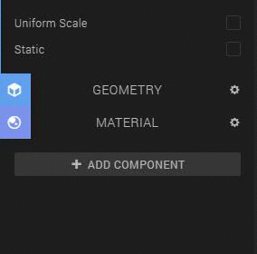
5. Rename the behavior to 'Moon rocket behavior'
5. Rename the current state to 'Waiting for click'
6. Add a *Pick action* by clicking the *Add action* button, search for 'pick' and then double-clicking the *Pick* action
7. Add a new state

8. Rename the new state to 'clicked'
9. Add an *Emit Message action* by clicking the *Add action* button, searching for 'emit' and then double-clicking the *Emit Message* action
10. Set the message to 'clicked' in the *Emit Message Channel*
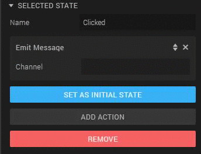
11. Connect the two states
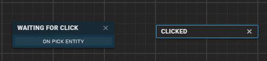

## Receive message from Moon Lander

1. Select the *Timeline entity* in the *Hierarchy panel*
2. Add a *State machine component* in the *Inspector panel*
3. Create and edit a new behavior by pressing the *+*

5. Rename the behavior to 'Timeline behavior'
6. Rename the current state to 'Waiting for click'
7. Add a *Listen action* by clicking the *Add action* button, search for 'listen' and then double-clicking the *Listen* action
8. Set the *message channel* to 'clicked' in the *Listen Message Channel* box
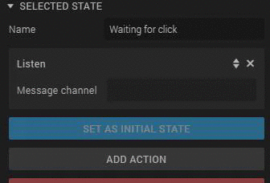
9. Add a new state

10. Rename the new state to 'clicked'
11. Add the *Start timeline* action by clicking the *Add action* button, searching for 'start' and then double-clicking *Start timeline*
12. Connect the states
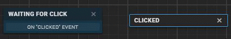

Press the *Play button* and see what happens when you click the Moon Rocket!

Now you're ready for the final part in which you're going to add the rocket flames.
