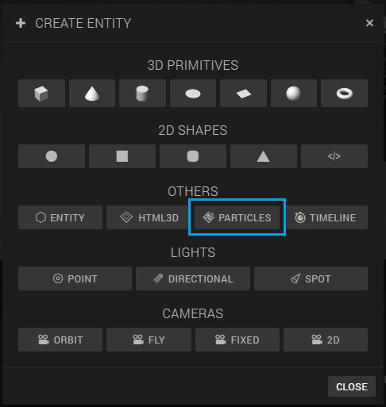
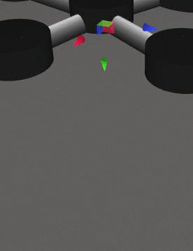
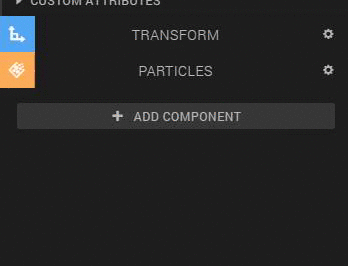
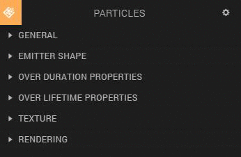
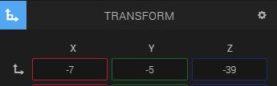
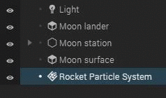

# Particle system

To create the rocket flames, we're going to add a *particle system* to our scene. What is a particle system? Particles are simple images or meshes that are moved in great numbers by a particle system. The particle system can change the size, color, direction and speed of the particles during their lifetime. This is very useful for when you for instance want to make a fire. When you make a particle system for a fire, you want the particles to move upward and the color to change from white to yellow to red.

# Creating the Rocket flames

Now you have an idea of what a particle system is, we can start creating the rocket flames for our Moon rocket

## Adding a particle system to the scene

1. Click the *Create Entity* button at the top center of the canvas

2. Rename the Particle System to 'Rocket Particle System'
3. Set the *Transform component* > *X Rotation* to 180
4. Position the particle system to a point where you can see the whole particle system

5. Focus on the particle system by pressing 'S' on your keyboard

##  Editing the particle system

To edit the particle system, open up the *Particles component* in the inspector panel:

1. Make sure the just added particle system is selected in the *Hierarchy panel*
2. Unfold the particle system in the *Hierarchy panel*

3. Unfold *General*

4. Uncheck autoplay, set the *Duration* to '2', check the *Prewarm* checkbox, set *Y gravity* to '-50',
5. Unfold *Over Duration Properties*
6. Set *Emission Rate* to '30', *Start size* to '8', *Start color* to HEX '29165b', *Start life time* to '1'
7. Unfold *Over Lifetime Properties*
8. Set *Color* from 'Constant' to 'Gradient'. Keep the first color of the gradient white, and set the second one to HEX 'f0ff00', which is yellow. Also, change the *Size* from 'Constant' to 'Linear', and set the first value to '3' and the second value to '1'

Well done, you've made your first particle in Goo Create! If you want to learn more about the particle system, play around with it for a bit. The fastest way to learn about the particle system is to change values and see what happens. Before you know it, you're a particle ninja! But for now, let's put the rocket flames under the Moon rocket.

# Bind the Particle to the Moon Rocket

1. Give the Rocket Particle System the following translation:

2. Drag and drop the 'Rocket particle system' entity in the 'Moon lander' entity.

We put the Rocket particle system inside the Moon Lander entity, because it will make the rocket particle system a part of the Moon Lander. So when the Moon Lander moves, the Rocket particle system will move as well, and that is exactly what we want.

Press the *Play button* to checkout your scene in action!
