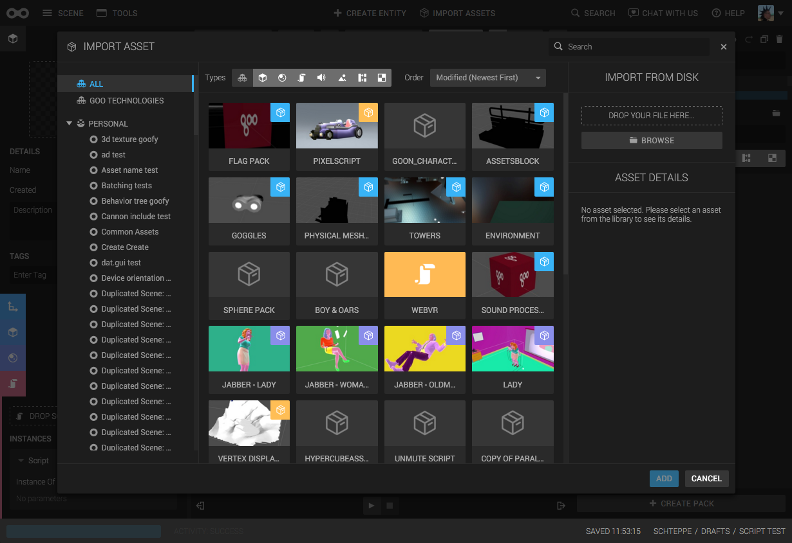
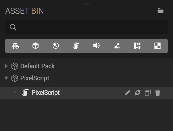

The *Asset Library* is a place where you can put entities or assets, and later import them into other scenes.

## Importing from the Asset Library

Start by opening the Asset Library dialog by clicking *Import Assets* in the top menu.

From here you can browse assets by Organization, project and type. It's also possible to import a file to add it directly to the library.

Choose an asset by clicking it once, and then click the *Add* button in the right bottom of the dialog window. The asset will be loaded and added to the Asset Bin when it's ready.

## Adding an Asset to the Asset Library


	
		
	

You can not add an Asset directly to the Asset Library. You need to put it in a pack first. More information [here]({{ packs-url | prepend: site.baseurl }}).