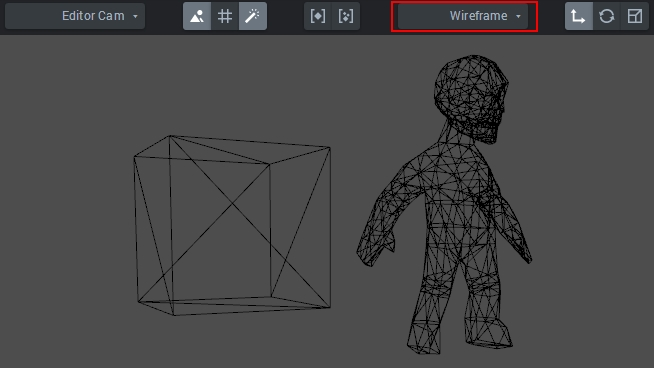
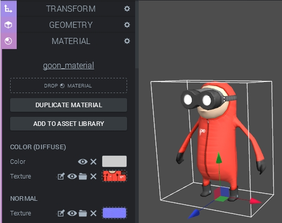
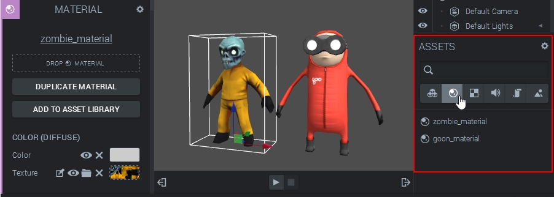
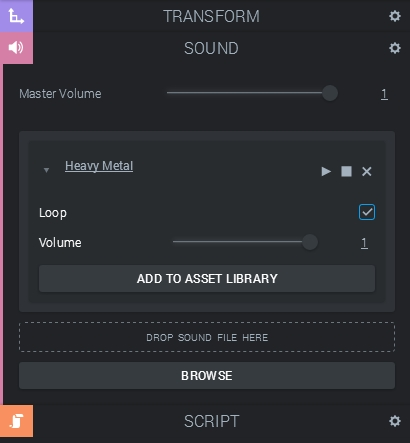
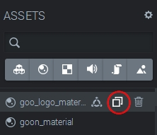
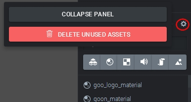
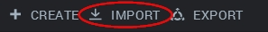
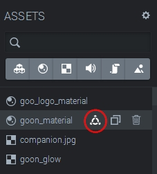
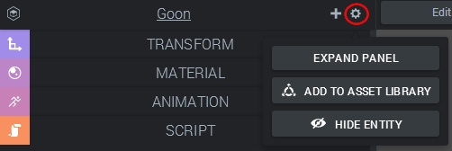

### Meshes

A mesh is a set of points (vertices) which defines the _geometry_ of a 3D model. Every renderable 3D entity must therefore have a mesh (and a material, which we'll discuss later). Mesh data is handled by the [MeshDataComponent ](http://code.gooengine.com/latest/docs/MeshDataComponent.html) in the engine. Mesh data not only includes vertices, but also normals and the local bounding volume, for example. At the time of writing, mesh data can not be modified directly in the Create interface. The exceptions are some primitives, where some _geometry parameters_ can be adjusted.  

  

Meshes can be viewed in Create by setting the rendering mode to "Wireframe".  

### Materials

A renderable 3D entity must have a mesh and a material ([Material](http://code.gooengine.com/latest/docs/Material.html) class in the engine). A material defines the look of the entity, and is composed by a large collection of various settings. Some settings have color and texture channels, while others are represented by a value or multiple options. Each material has basic settings like diffuse and specular color, as well as advanced settings such as refraction and blending modes.  

  

The Material Panel  

Materials can be shared between entities. If a material is shared, changing the look of one entity will also change the ones which are sharing the material! All materials are viewable from the right-hand **Asset Panel**. From there, materials can be dragged onto the dotted _Drop Material_ area at the top of the Material Panel.  

  

The Asset Panel, filtered to show only materials.  

### Textures

Each material has a few different texture channels. A texture ([Texture](http://code.gooengine.com/latest/docs/Texture.html) class in the engine) is basically a 2D image which will get interpreted in different ways depending on the texture type. The simplest channel is the diffuse color channel which maps the pixel colors onto the entity directly. Another example is the normal map channel, will interpret the RGB values as (x, y, z) normal vectors.  

Importing textures is very easy, it's possible to just drag and drop 2D images from the desktop to the dotted texture drop area (or click the little folder icon to browse for the files). Textures can also be reached from the Asset Panel and be dragged around for sharing!  

  

Moments after importing a texture using a jpg image  

There are advanced texture settings (texture repeat, offset and so on) which are reachable by clicking the edit button next to the texture in the Material Panel.  

 Accessing texture settings (click for full size image).  

### Sound Clips

A S[ound](http://code.gooengine.com/latest/docs/Sound.html) can be added to a [SoundComponent](//code.gooengine.com/latest/docs/SoundComponent.html). In Create, this is done by simply adding a sound component to an entity and then dragging-and-dropping or browsing for a file (mp3 or wav). Sounds behave a little differently than other assets. If a sound file is dragged and dropped onto the canvas, it will not automatically be added to an entity, but only show up in the Asset Panel. From there, it can of course be added to sound components. Additionally,  sounds _don't play automatically_. They have to be started by a **state machine** instance or a **script**.  

  

The Sound Panel  

### Scripts

A script belongs to a [ScriptComponent](http://code.gooengine.com/latest/docs/ScriptComponent.html), and can be created after adding such a component to an entity. After a script has been created, it will be accessible from the Asset Panel and can from there be shared with other script components! One somewhat tricky thing to keep in mind is that creating or sharing a script actually creates a separate **instance** of that script. This way, scripts can be shared or even added multiple times to the same script component.  

  

Adding an existing script to a script component  

## The Asset Panel

The Asset Panel collects all shareable assets in the scene. It has a search box and filter buttons to sort through the assets easily.  

### Duplicating Assets

All assets in the panel can be duplicated by clicking the corresponding icon. This creates an independent copy of the asset which can be edited individually.  

  

Duplicate an asset  

### Removing Unused Assets

Having too many assets will affect performance negatively, since bandwidth and loading times are very important for web applications. There is a useful function which deletes all currently unused assets in the scene, but use this with caution as it is **not reversible**! You are strongly recommended to take a _snapshot_ of your project before doing this. The button is accessible by first clicking the gearbox icon at the top of the panel.  

  

Showing the button to remove all assets  

## The Asset Library

Configured assets can be added to the Asset Library for re-use later. That means that if you have a perfect material you'd like to store, or the most amazing entity mankind has ever seen, you can very easily add it straight from the Asset Library later. The library is accessed by clicking the Import button at the top of the interface.  

  

Access the Asset Library  

The Asset Library has a list of different sources and collections, including your own added assets. Assets can be added to the library by clicking the _Add To Asset Library_ button (easy, eh?) next to the asset in the various panels, or with the icon in the Asset Panel.  

  

Add an asset to the library  

Whole entities can also be added to the library, of course! The option for adding is accessed by first opening the _Entity Options_ by clicking the gearbox icon at the top of the _Entity Inspector_.  

  

Adding an entity to the asset library