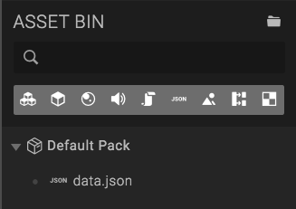
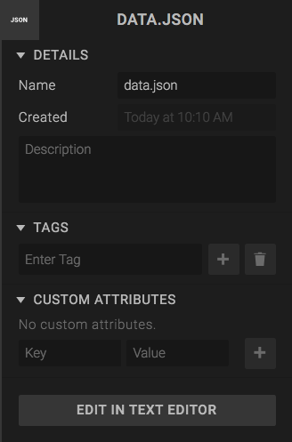
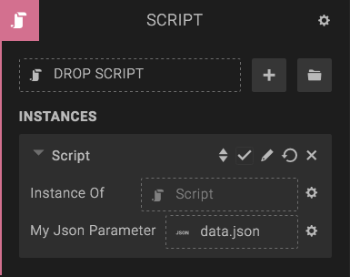

A *JSON Asset* represents a JSON-formatted text file, that you can access in Scripts.

To add a new JSON asset, drop a *.json* file onto the *Asset Bin*. When loaded, the asset will end up in the Asset Bin in the *Default Pack*, ready to use.

If you click the JSON Asset, you can edit its settings in the left panel. You can also click the *Edit in script editor* button to edit the JSON data.

If you add a "json" parameter in a Script, your can drop a JSON asset as a parameter, and access the JSON inside the script.

Sample script:

var setup = function (args, ctx) {
    console.log(args.myJsonParameter); // Prints the parsed JSON data
};

var parameters = [{
    key: 'myJsonParameter',
    type: 'json'
}];