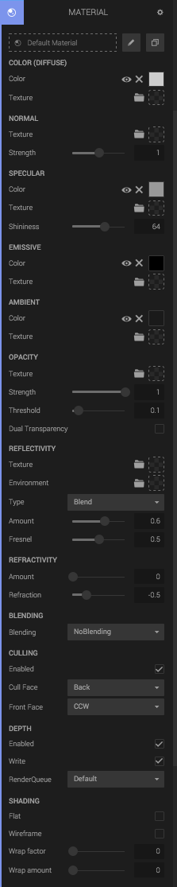

A renderable Entity must have a Geometry Component and a Material Component. The Material Component holds a single *Material Asset*, which defines the look of the geometry.

## Settings

The Material Asset has a number of settings.

<iframe src="//c1.goote.ch/57cf93a0fc0944fcb9fe1098457380c5.scene/"></iframe>

### DIFFUSE COLOR

The Diffuse Color controls the base color of the surface.

**Color** is the base diffuse color.

**Texture** can be used to set the diffuse color from a texture.

### NORMAL

Normal maps are a type of Bump Map. They are a special kind of texture that allow you to add surface detail such as bumps, grooves, and scratches to a model which catch the light as if they are represented by real geometry.

You set the normal map via the **Texture** input, and you can alter its magnitude by setting the **Strength** value.

### SPECULAR

Specular effects are essentially the direct reflections of light sources in your scene which typically show up as bright highlights or shines on the surface of objects (although specular highlights can be subtle or diffuse too).

You can set the base specularity **Color**, use a **Texture** and set the **shininess** value.

### EMISSIVE

This is the self-illumination color an object has. You can set the emissive color using the **Color** input and/or via a **Texture**.

### AMBIENT

Ambient color is the color of an object where it is in shadow. This color is what the object reflects when illuminated by ambient light rather than direct light. 

**Color** sets the base ambient color.

**Texture** This ambient map identifies areas on a mesh that are exposed or hidden from ambient lighting.

### OPACITY

The opacity is used when using the *Translarent Blending* mode. The **Strength** allows you to input a value between 0 and 1 where 0.0 represents completely transparent and 1.0 represents fully opaque.

**Threshold** is used to indicate when a surface is completely transparent, and can be discarded from rendering.

**Dual Transparency** 

### REFLECTIVITY

**Texture**: Reflectivity texture.

**Environment**: Environment map that you will see in the reflection. If not selected, the current Skybox will be used.

**Amount**: Amount of reflectivity to use.

**Fresnel**: A nonzero fresnel value will result in less reflection depending on the normal direction.

### REFRACTIVITY

The Refraction input takes in a texture or value that simulates the index of refraction of the surface. This is useful for things like glass and water, which refract light that passes through them. The environment texture will be used for the refraction.

**Amount**: How much refraction to blend with the current color.

**Refraction**: The ratio of the refractive indices involved in the refraction.

### BLENDING

The blending mode to use for the material. You can choose between

* NoBlending
* TransparencyBlending
* CustomBlending
* AdditiveBlending
* SubtractiveBlending
* MultiplyBlending

The blending modes have individual settings.

### CULLING

Whether to cull on the triangle level, and which face (back, front, both) to cull.

### DEPTH

Whether to enable depth testing, depth writing and which **RenderQueue** value to use.

### SHADING

**Flat**: Turns on flat shading for the mesh.

**Wireframe**: Renders the mesh in wireframe mode.

**Wrap factor**:

**Wrap amount**:

## Adding Materials to a Material Component

All materials are viewable from the right-hand Asset Bin. From there, materials can be dragged onto the dotted _Drop Material_ area at the top of the Material Panel.  

Note that Material Assets can be shared between entities. If a Material Asset is shared, changing the look of one entity will also change the ones which are sharing the material. 