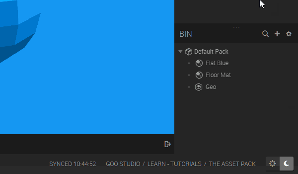
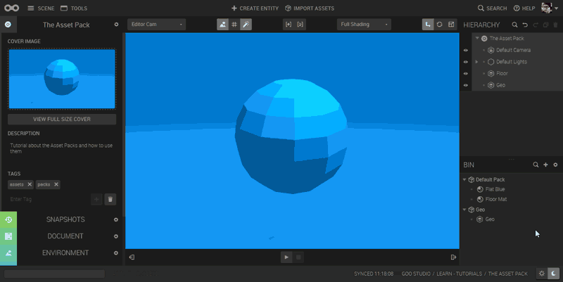
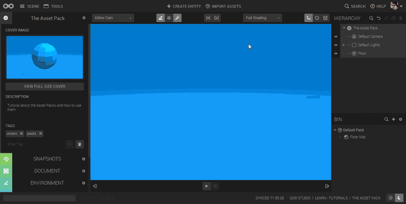

An *Asset Pack* is a smart folder that lets you publish one or more assets (and their dependencies) to the asset lib.

## The Default Pack

Create new Scene and look at the Asset Bin. You'll notice there's already a *Default Pack*. This is where all the assets (except Entities) you create in your Scene will end up.

## Pack Creation

To create a pack, click the *Create Pack* button.

To add an entity to the pack, drag it from the hierarchy view onto the pack. You will notice that the dependencies of the entity will be added as well, and these will appear in gray.

You can also add assets from another pack (for example, the *Default Pack*) to your new pack.

## Editing a pack

To edit the pack, click the pencil icon. This brings up the *Edit Pack* dialog, where you can add a name, type, description, screenshot, or tags to your pack. Add as much as possible of this, since it's useful when you search or browse assets.

## Adding the pack to the asset library

To add your pack to the asset library, click the *Add to Asset Library* button in the *Edit pack* dialog. This makes the asset available in all scenes of your project.

## Importing a Pack from the Asset Library

Click the Import Assets button on the top menu to start browsing asset packs. Select the desired Asset Pack, click Add and it will now be added to the Asset Bin. Now you can start adding assets from the pack to your scene.

