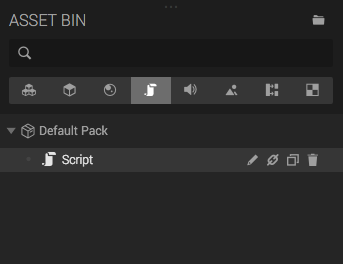

A *Script Asset* is some JavaScript code that can interact with entities in Create. To add a Script Asset to an entity, the entity needs a [Script Component]({{ '/manual/scene/components/script' | append: site.baseurl }}).

## Creating a Script

There are several ways of creating a Script Asset:

* Create a Script component on an entity, click the + button in the Script Component panel, and choose *Custom Script*.
* Click the + button in one of your Asset Bin packs, and choose Script.
* Drop a JavaScript (.js) file on the viewport.

When done, the Script will appear in the Asset Bin.

## Editing a Script

If you click the Script in the Asset Bin, the Script Panel is opened to the left. Here you can add meta data to your script, or open the Script Editor to edit the code of your script.

Read more about scripting in the Scripting section.

## Adding Scripts to Entities

To add a Script Asset to an Entity, it needs a Script Component. To add a Script Asset to the Script Compoent, drag and drop the Script Asset from the Asset Bin to the drop area in the Script Component.