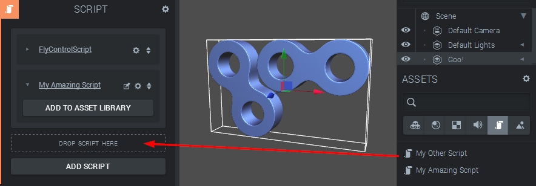

A script belongs to a [ScriptComponent](http://code.gooengine.com/latest/docs/ScriptComponent.html), and can be created after adding such a component to an entity. After a script has been created, it will be accessible from the Asset Panel and can from there be shared with other script components! One somewhat tricky thing to keep in mind is that creating or sharing a script actually creates a separate **instance** of that script. This way, scripts can be shared or even added multiple times to the same script component.  

  

Adding an existing script to a script component  