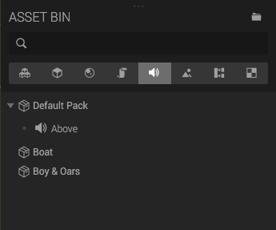
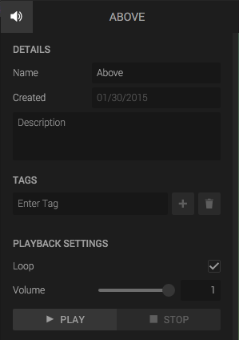
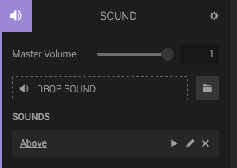

A *Sound Asset* represents a binary audio file with some settings.

To add a new Sound asset, drop an audio file onto the viewport. When loaded, the asset will end up in the Asset Bin in the *Default Pack*, ready to use.

If you click the Sound Asset, you can edit its settings in the left panel.

The Sound asset can be added to a Sound Component by dragging the asset from the Asset Bin to drop area in the component.


	
		
	

[Read more about the Sound Component here]({{ sound-component-url | prepend: site.baseurl }}).