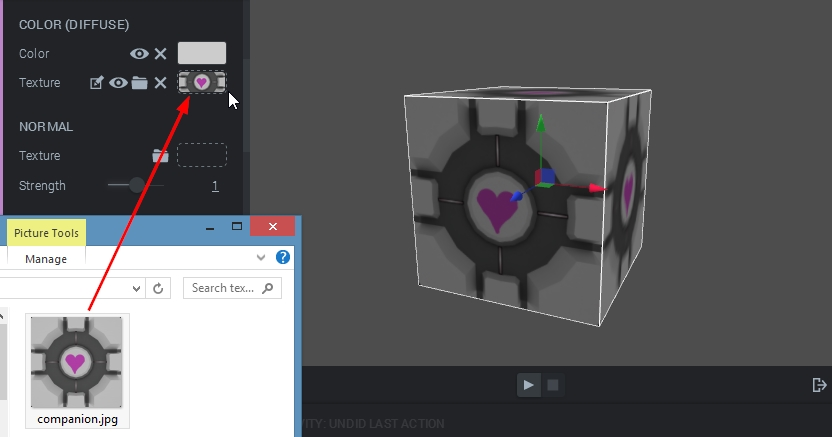
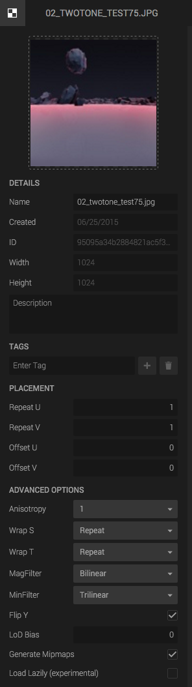

A Texture asset is a 2D image file with a few settings. You can use it in your Materials, Scripts or use it as a Skybox.

## Importing a Texture

To add a Texture Asset to the Asset Bin, simple drag and drop an image file from your desktop on top of the viewport.

## Using a texture

To use a texture, for example, in a Material, just drag and drop it from the Asset Bin into the desired drop area. You can also drop an image file directly into the texture drop area.

## Texture settings

There are advanced texture settings (texture repeat, offset and so on) which are reachable by clicking the texture asset in the Asset Bin.

## Repeat

The scale of the texture. The larger value, the more repeating you get.

## Offset

The texture offset coordinates.

## Anisotropy

## Wrapping

This setting tells the Create what to do when it reads outside of the texture range. The following options are available:

**EdgeClamp**: use the closest pixel value on the texture.

**Repeat**: repeate the texture.

**MirroredRepeat** repeat it but flip the texture each time.

## MagFilter & MinFilter

## Flip Y

Flips the texture upside down.

## LOD bias

## Generate MipMaps

Whether to generate mipmaps for the texture. Mipmaps increases rendering speed and reduces aliasing artifacts, but uses more GPU memory.

## Load Lazily

If this option is used, then the texture won't be loaded until you call

{}
texture.loadImage();
{}

from a script.