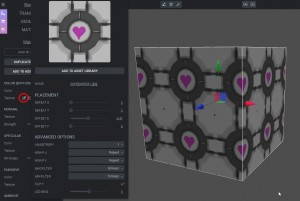

Each material has a few different texture channels. A texture ([Texture](http://code.gooengine.com/latest/docs/Texture.html) class in the engine) is basically a 2D image which will get interpreted in different ways depending on the texture type. The simplest channel is the diffuse color channel which maps the pixel colors onto the entity directly. Another example is the normal map channel, will interpret the RGB values as (x, y, z) normal vectors.  

Importing textures is very easy, it's possible to just drag and drop 2D images from the desktop to the dotted texture drop area (or click the little folder icon to browse for the files). Textures can also be reached from the Asset Panel and be dragged around for sharing!  

  

Moments after importing a texture using a jpg image  

There are advanced texture settings (texture repeat, offset and so on) which are reachable by clicking the edit button next to the texture in the Material Panel.  

 Accessing texture settings (click for full size image).  

