With the collaboration and sharing feature _Organizations_ just released, we thought it would be a good idea to go over some of the basics of how to work with it.  

## What are Organizations?

Organizations is a feature enabling teams to collaborate efficiently. Included are tools to manage and share assets with other users and work on the same projects. [Look here](http://goocreate.com/pricing) for pricing info.  

## How to Create an Organization

1.  If you don't have an account, create one as a regular, non-paying user at [https://app.goocreate.com/register](https://app.goocreate.com/register).
2.  You should be taken to the **Dashboard**. Click _Organizations_.
3.  Click _Create Organization_.
4.  Enter your Organization and payment details.
5.  Press _Create_.

You can now reach your new Organization from the Dashboard.  

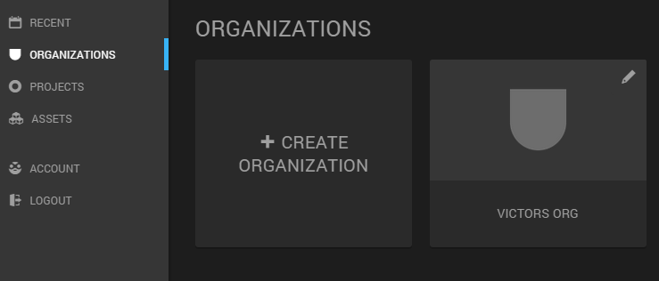  

After creating a new organization  

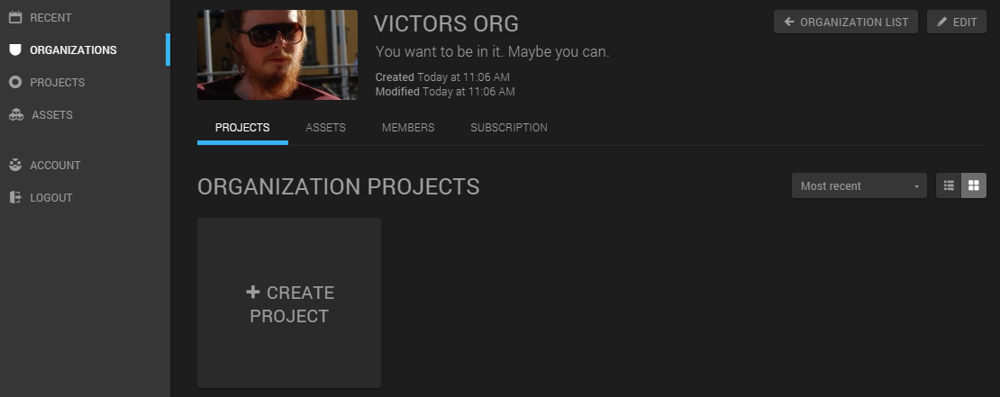  

Organization details after editing the image and description  

## How to Add Members

Adding members to an Organization is very easy. All you need to know is the _user name_ of the member you want to add. While looking at the Organization details, click the _Members_ tab and select _Manage_. Now simply type a username, and click _Add_. Note that the input field will turn green if the username is valid.  

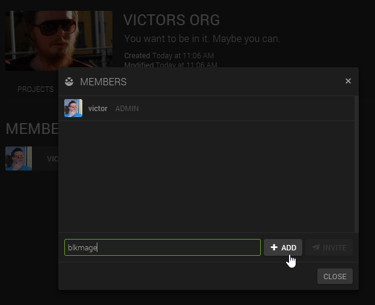  

Adding a member  

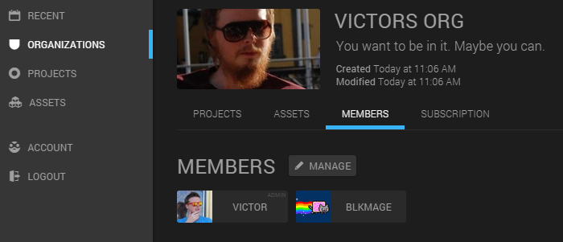  

The member list after adding _blkmage_  

## How to Add a Project

If a Project is created within an Organization, all members will be able to work with it. Very useful! Either click the _Create Project_ button in the _Projects_ tab of the Organization, or go directly to _Projects_ in the left hand menu. In either case, note that the Organization is selected in the drop-down menu.  

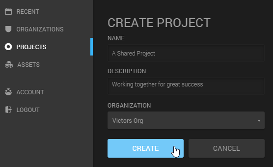  

Creating a shared Project. Note the drop-down Organization menu.  

## How to Work with Locks

A Lock is a mechanism to prevent weird things to happen if two or more users want to edit the same project at the same time. At this time, you simply can't. Only one user at a time can own a Lock on a Scene. That user will be the only one able to edit. When entering a scene that another using is viewing or editing, you are given the opportunity to _steal_ the Lock. If you do, you'll get the exclusive rights and the other user will get kicked out. Communication is encouraged!  

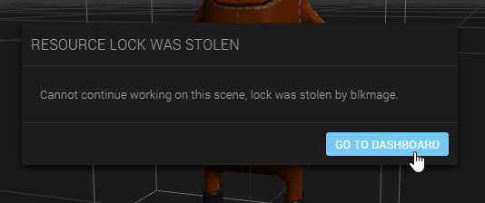  

Oops! Another team member decided to get the exclusive rights. For now.  

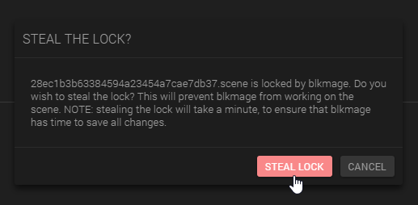  

If you try to enter a Scene with a Lock on it, you can choose to take over or exit.  

## How to Add Assets to the Organization

A really neat feature of Organizations is the ability to share Assets ([read more about Assets here](http://www.goocreate.com/learn/assets-in-create/ "Assets in Create")). There are two ways to create shareable Assets. You can either create the Asset directly from a shared Project, or you can copy personal assets into the Organization.  

### Directly to the Organization

When working in a shared Project, adding resources to the Asset Library will automatically share them with the Organization members. Simply click any of the Add to Asset Library buttons, enter details and click Add.  

Note: At the time of writing, the title of the dialog is wrong. It says "Personal Library" but it's really "Organization Library". This will be fixed very soon.   

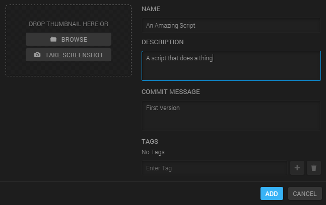  

Adding an asset to the Organization  

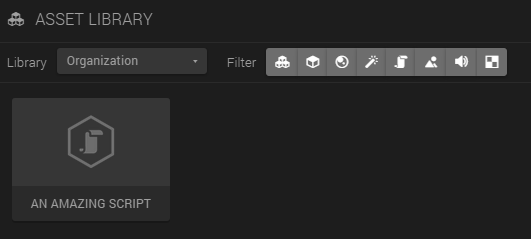  

After adding the Asset, it shows up in the Asset Library. Note the Organization library selection.  

### Copying a Personal Asset

If an Asset is in a personal, non-shared, library, it's easy to copy it to an Organization.  

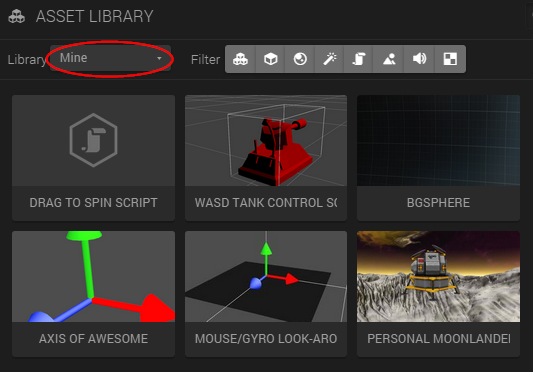  

A personal Asset  

Go to the **Dashboard**, and select Assets in the left-hand menu. Locate the asset you want to share (_Personal Moonlander_), click the gearbox icon, and select _Copy To_.  

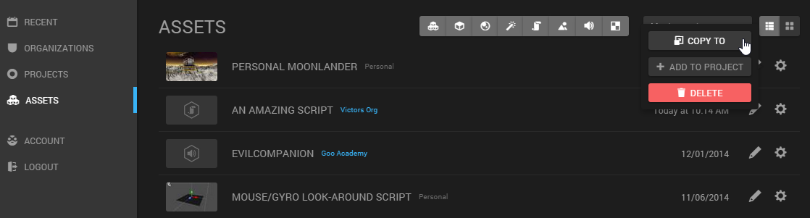  

Choosing an Asset to copy  

Select the desired Organization. After copying, you should now have two copies of the asset. One personal, and one shared.  

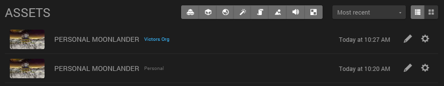  

One personal and one shared copy of the Asset.  

### Viewing and Managing the Shared Assets

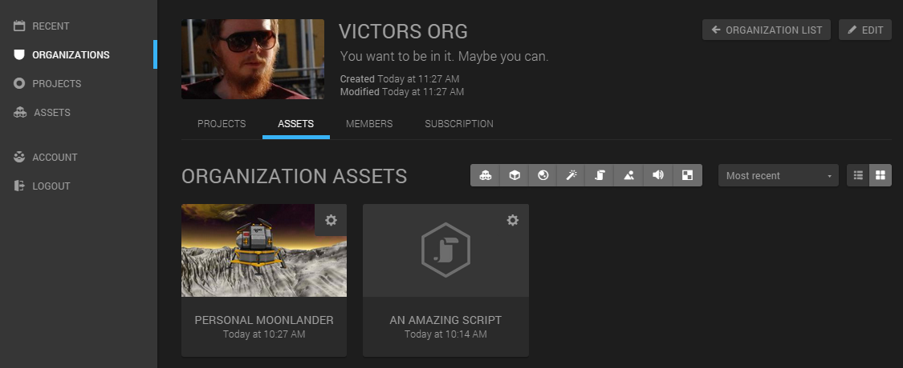  

The shared assets can be viewed and managed from the Organization view in the Dashboard.