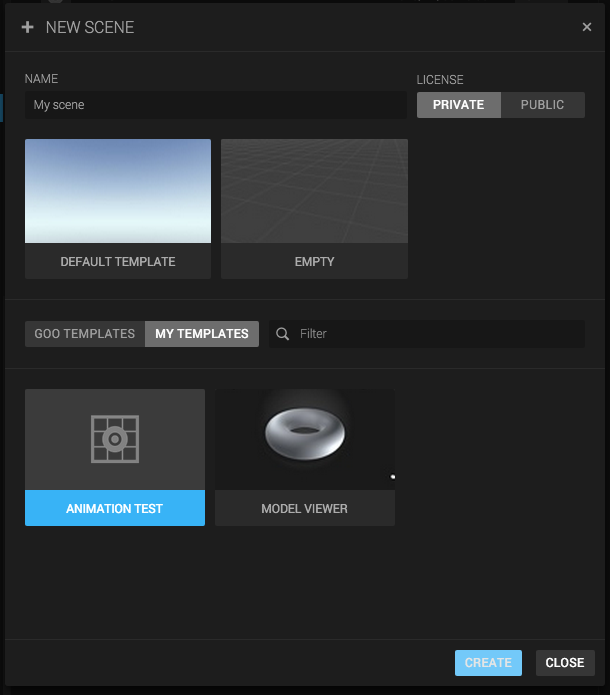
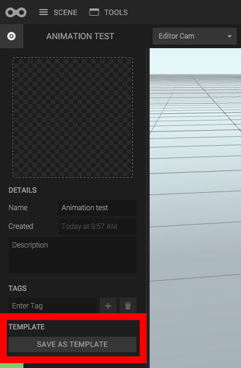
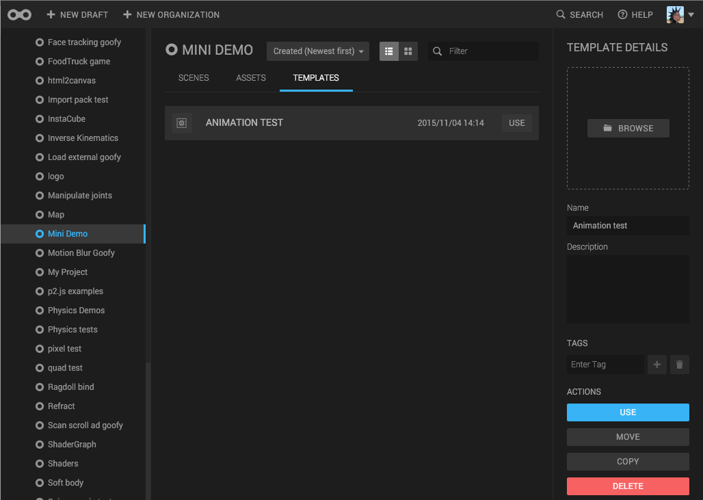

A template is just a scene that you base other new scenes off of. So that you don’t have to start with a blank page unless you really feel like it.

There are a few default Goo templates in the "New scene" dialog when you open it, but you can also create your own scene templates. Just hit “Save scene as template” in the Scene panel.

Some things to remember:

* Only scenes that have been explicitly made into templates will show up among the templates
* Templates are “locked”. To update the template, you must save the scene as a template again. Just updating the scene won’t do. (Which is also nice, you don’t have to be afraid you’ll mess up the template)
* Templates belong in projects, just like assets and scenes. You can share templates by putting them in shared projects.

You can also see your templates in the "Templates" tab in your project:

