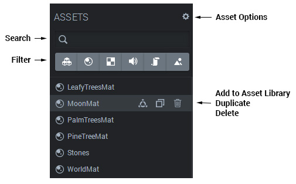

The Asset panel shows all assets belonging to the scene. These can be _materials, textures, sounds, scripts_ or _skyboxes_.

The Asset panel

The panel has filters for showing particular types of assets, and a search bar to find a specific asset. The top right **asset options** contains the very useful _delete unused assets_ functionality. Each asset can be **added to the asset library**, **duplicated** or **deleted**.