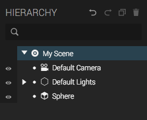

The hierarchy panel shows all entities in the scene and their parent-child relations in the _scene graph_. Parents are shown at a smaller indentation level than their children. The children's _transforms_ are relative to their closest parent, so the hierarchy can be manipulated to make entities connect to each other and rotate, scale and move with their parents.

To move entities around in the graph, simply drag and drop the entities in the menu.

At the top of the hierarchy there's the Scene root. Click it to start editing the Scene properties in the *Inspactor*.

  

The panel has controls for hiding and showing entities, expanding or collapsing hierarchies, to duplicate or delete entities, or undo the latest action (any action in Create).