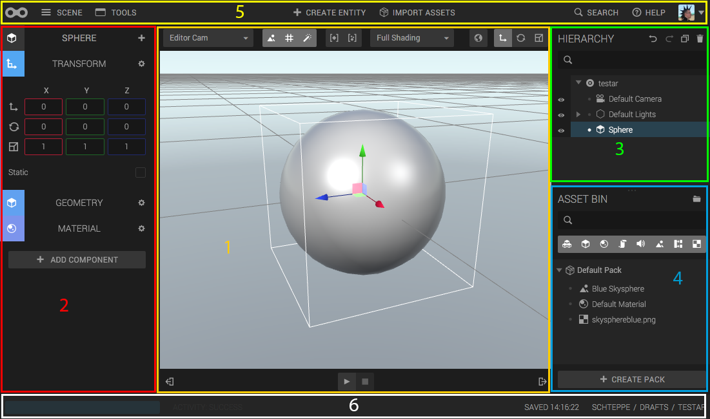

Let's have a look at the Goo Create 3D Editor interface.

*The main interface of Goo Create. Click for larger image.*

The areas can, very roughly, be broken down into the following areas. Let's go over them one by one.

1. The Canvas
2. The Inspector
3. The Hierarchy
4. The Assets
5. The Top Menu
6. The Bottom Menu
