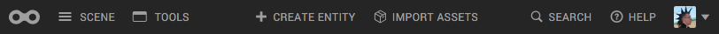
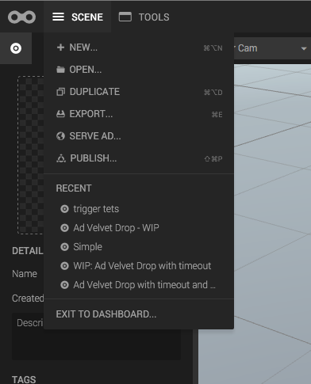
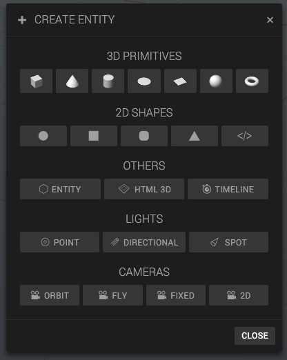

The top menu, or the top area, is not as focused as other panels or sections. It contains many small groups with different functionality, so let's quickly go over the main features.  

* **Logo**: Go to the dashboard.
* **Scene**: Create new scene, publish/export your scene, or access recent scenes.
* **Tools**: Access tools like the Script editor or the Timeline.
* **Create entity**: Opens a dialog for creating entities, such as 2D and 3D primitives, lights, cameras and HTML entities.
* **Import assets**: Opens the asset library.
* **Help**: Useful help links and a nice shortcut list.
* **User Avatar**: Exit to dashboard, change password or log out.

*Scene menu*

*The Create panel, accessible from the top menu*