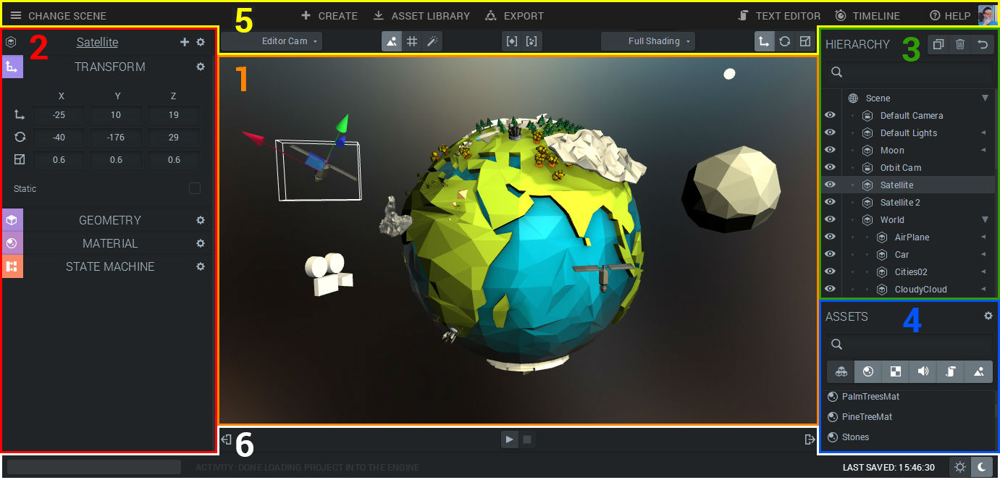
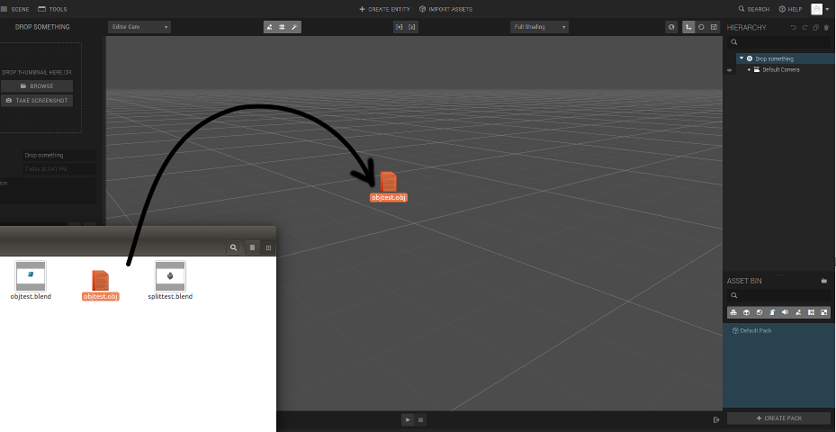

In the center of the editor, the WebGL-rendered viewport is located. Here you can nagivate, inspect and preview the contents of your scene.

## Dropping external files on the viewport

By dragging and dropping files on the viewport you will issue an import of that file.

The currently supported importable files include:

- 3d-models

  : {{ format.suffix }}

- images 
- sounds

More on importing 3dmodels can be found here <<< todo: insert link to import section >>>