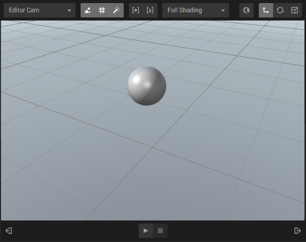

In the center of the editor, the WebGL-rendered viewport is located. Here you can navigate, inspect and preview the contents of your scene.

## Navigation

For the best navigation experience you will need a two buttoned mouse with a scroll wheel.

The complete list of navigation keys are documented as a cheat sheet inside create, under help -> shortcut list.

- Mouse 1: Select entities inside the scene.

- Mouse 2 + drag <strong>or</strong> Alt + Mouse 1 + drag: Rotate around the current focus point.

- Mouse wheel scroll: Zoom in and out towards the current focus point.

- Mouse 3 + drag <strong>or</strong> Shift + Mouse 1 + drag: Pan in x/y directions.

## Edit / Play modes

Press the bottom *Play* button to start your scene. This will start all systems in Create, start animations, run state machines, etc.. During play mode you can press *Pause*. Lastly, you can go back to Edit mode by pressing *Stop*.

## Canvas top menu

Above the canvas, there are a number of rendering and editing options. You can:

* **Camera Select:** select which camera to use while in edit mode.
* **Toggle skybox**.
* **Toggle grid**.
* **Toggle post effects**.
* **Frame current selection**.
* **Frame all**.
* **Switch shading mode**.
* **Switch between local/global gizmos**.
* **Switch between translation/rotation/scale gizmos**.

## Dropping external files on the viewport

By dragging and dropping files on the viewport you will issue an import of that file. It is also possible to import files by dropping on the asset bin.

The currently supported importable files include:

### 3d-models


- {{ format.suffix }}



	
			
	

More on importing 3dmodels can be found at [Importing 3D-models]({{ model-page | prepend: site.baseurl }})

### Images


- {{ suffix }}


### Sounds


- {{ suffix }}


### Videos


- {{ suffix }}


### Scripts

Import your JavaScript files.

