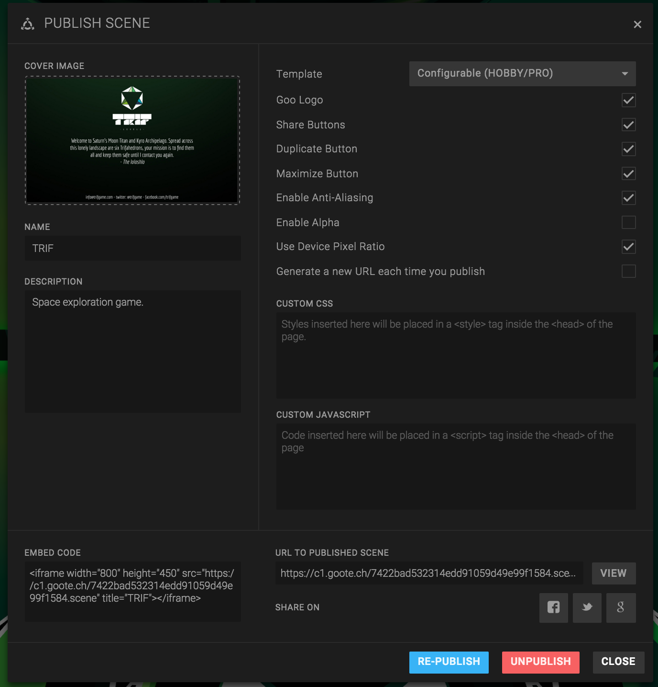
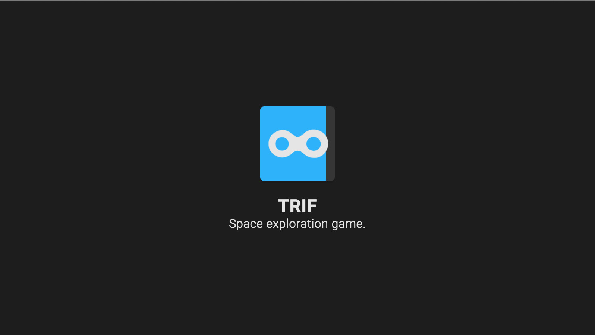
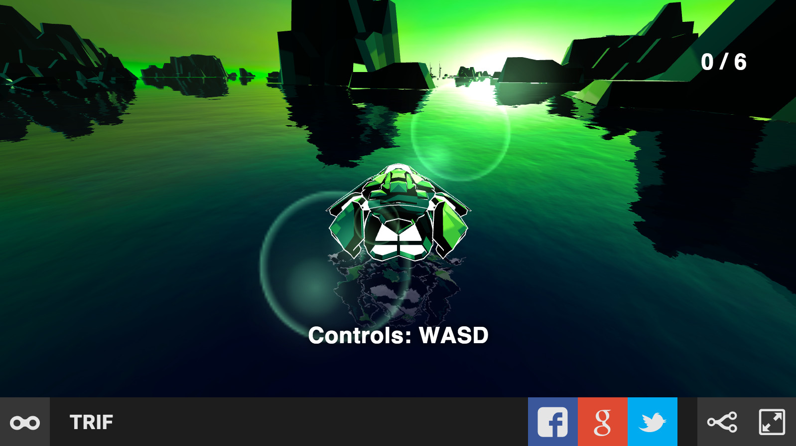

The easiest way to get your 3D Scene online is to publish it to the Goo cloud.

1. Create a scene.
2. Open the Publish dialog in *Scene > Publish...*.
3. Edit the publish settings.
4. Click Publish.

After a few seconds, your scene is live. You can click *View* to open it.

*The publishing dialog*

## Publishing settings

### Template: Standard, Configurable or Transparent

There are three publishing templates you can choose from, and the rest of the publishing settings will adapt to what you choose here.

* *Standard*: This is the default template and contains the Goo Create logo and branding as well as buttons to share on social networks, a button to edit/fork the scene in Goo Create and a maximize button.
* *Customizable*: This template lets you easily enable or disable most of the features of the Standard template. For instance, if you don’t want to include the Goo Create logotype and branding, you can do so with a single click.
* *Transparent*: This template includes no loading screen and no background image or fallback. It is intended for when you wish to include your scene in another page seamlessly.

*The standard template in the loading phase.*

*The standard template after loading.*

### Cover image

This cover image is the thumbnail for the scene, you will see it in the Dashboard and in the Gallery.

### Name & description

These will be shown on the loading screen of your published scene.

### Goo Logo

This will toggle the Goo logotype in the corner.

### Share buttons

This will toggle the Facebook and Twitter buttons.

### Duplicate button

This will toggle duplicate button in your published scene.

### Maximize button

This will toggle maximize button in your published scene. This button enables you to run your scene in full screen.

### Enable Anti-aliasing & Use Device Pixel Ratio

These are rendering settings. Anti-aliasing will render triangles more smoothly.

Using device pixel ratio will enable higher resolution on some devices, for example Retina screens. Warning: using too high resolution may kill performance.

### Enable Alpha (transparent background)

If your scene has a transparent background, and you want to use it, for example when embedding as an iframe on top of something else, then you should check this checkbox.

Note that you need to remove the Skybox to make transparent background work.

### Generate a new URL each time you publish

By default, the scene that you are editing gets a publish URL on the following form:


https://goote.ch/SCENE_ID.scene


But if you enable *transient publish URL*, you will get an URL on this form:


https://goote.ch/PUBLISH_ID


The PUBLISH_ID will be different for each time you publish. This can be useful sometimes.