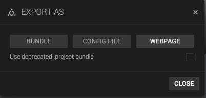

In order to host a Goo 3D Scene yourself, you need to export the scene as a webpage and put it on a web server.

1. Open your scene in Create.
2. Open the Scene menu in the top bar.
3. Click *Export*.
4. Choose *Export as Webpage*.

Wait for the scene to download as a zip-file. The contents of this file is ready to put on any web server.