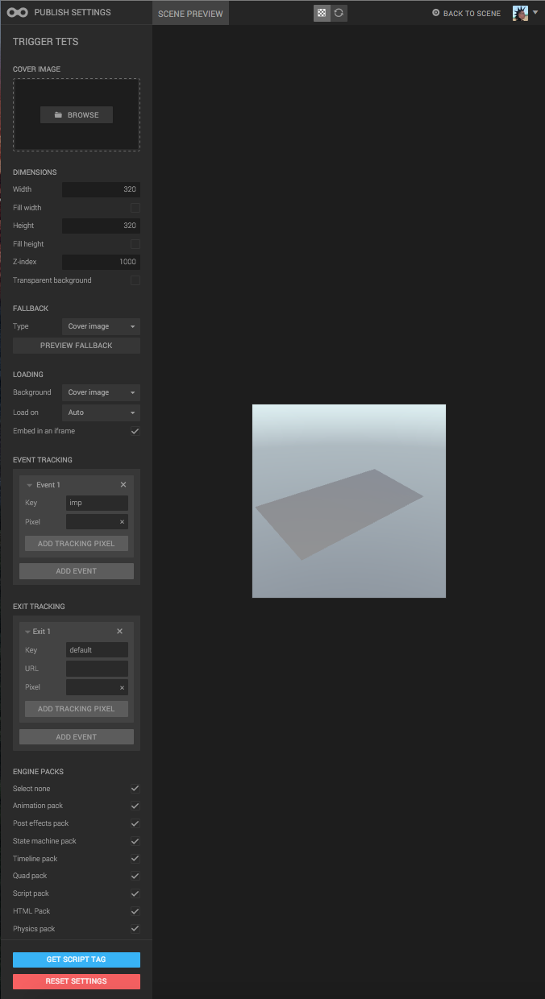

When you have made your ad ready, you can use our ad serving for embedding and tracking.

The easiest way to get started is to open the Publisher app. Open your scene and select *Scene / Serve Ad...* in the top menu bar. You are now taken to the Publisher app.



To the left, you can tweak for your ad. To the right, you get a preview of the result. When you have changed the settings, click the refresh button at top to update the preview.

When you are done with your ad settings, you can get a script tag for it by clicking the "Get script tag" button at the bottom. Copy and paste this tag into any HTML page and it will embed your ad.

## Script tag reference

When you generate the script tag, you get something on the following format:


<script id="goo123"
src=".../serve.js?param1=val1&param2=val2&..."
type="text/javascript"></script>


The parameters need some further explanation.

### elementId (required)

This is the id that the created DOM element will get. When everything is loaded, you can get the element by this ID and manipulate it.

### sceneId (required)

The ID of the scene to load, for example "cd83beb3b2e34cc6839377be95949054.scene".

### publishId

If you published your scene using the *Transient URL* option in Create, then you can enter the hash of that published scene here. Note that you should still provide the sceneId parameter in addition to the publishId.

### sceneName

The name of the scene.

### noCache

Set to a non-empty string and this will add a timestamp/cachebuster when loading the scene, to prevent browser caching.

### zIndex = 1000

The z-index of the created DOM element.

### transparentBackground = false

Whether the DOM element should allow transparency or not.

### loadingScreen = thumbnail

What kind of loading screen that should be used. The following values are allowed:

* thumbnail
* transparent
* white
* black
* any CSS color in hex format

### iframe = false

Whether to embed the WebGL canvas in an iframe or not.

### mraid = false

Whether MRaid should be used.

### loadOn = polite

When the ad should start loading. Allowed values are:

* polite
* immediate

The "polite" loading mode will wait until the rest of the page has loaded before loading the Goo scene.

### engineVersion = latest

Which version of Goo Engine to load. Default value is "latest" but you can also use a fixed engine version like "0.15.1".

### features

A comma-separated list of engine packs to load. If your scene depends on physicspack (for example), then you need to add "physics" to this list. Available packs are:

* animation
* posteffects
* statemachine
* timeline
* quad
* script
* html
* physics

So, for example, adding the script and animationpack, set the parameter to:


features=script,animation


### fallback = thumbnail

What to use for fallback image, if the client browser doesn't support WebGL.

* "thumbnail"
* a URL
* a hex color	

### tracking = {}

Specifies tracking pixel URLs and on what events to hit them on. Built in events are:

* imp - will be hit on impression.
* fallback_imp - hit on impression if in fallback mode. If not specified, imp pixel is hit.

Sample tracking parameter value: 


{
    "imp": ['//imp_pixel1', '//imp_pixel2'],
    "myCustomEvent": ['//custom_pixel3', '//custom_pixel4']
}


If you use the value above, you'll get the imp_pixels hit when the ad loads in both normal and fallback mode. If you run ```gsrv.track('myCustomEvent')``` in a Goo Create script, then the custom_pixels will be hit.

Note that this JSON data parameter needs to be stripped from whitespaces and newlines, and also be URL-encoded, before it can be added to the URL. This is how to do that in JavaScript:


encodeURIComponent(JSON.stringify({
    "imp": ['//imp_pixel1', '//imp_pixel2'],
    "myCustomEvent": ['//custom_pixel3', '//custom_pixel4']
}));
// %7B%22imp%22%3A%5B%22%2F%2Fimp_pixel1%22%2C%22%2F%2Fimp_pixel2%22%5D%2C%22myCustomEvent%22%3A%5B%22%2F%2Fcustom_pixel3%22%2C%22%2F%2Fcustom_pixel4%22%5D%7D


### contentRoot

The root URL of the serve.js script.

### exit = {}

This parameter defines all exit URLs in your ad. If you from your goo scene run ```gsrv.exit('default')```, and you have the following value for the exit parameter:


{
    "default": {
        "url": "http://google.com",
        "tracking": ["http://tracking.pixel"]
    }
}


...then the client will hit the tracking pixel at "http://tracking.pixel" and open google.com in a new window.

Note that this JSON data parameter needs to be stripped from whitespaces and newlines, and also be URL-encoded, before it can be added to the URL. This is how to do that in JavaScript:


encodeURIComponent(JSON.stringify({
    "default": {
        "url": "http://google.com",
        "tracking": ["http://tracking.pixel"]
    }
}));
// %7B%22default%22%3A%7B%22url%22%3A%22http%3A%2F%2Fgoogle.com%22%2C%22tracking%22%3A%5B%22http%3A%2F%2Ftracking.pixel%22%5D%7D%7D


### border = false

Whether the ad should have a border or not. "true" will ad a 1px black border.

### catchTouch = true

Whether the ad should prevent scrolling when touching or mouse hovering on it.

### exitMacro

An exit macro, that will be prepended to your exit URL. The value of this macro could be for example:


exitMacro=%%CLICK_URL_ESC%%


## Sample tag


<script id="goo123" src="https://c1.goote.ch/srv/86fb84c42ac50a9eec6ba5456133276db62eb98d/serve.js?elementId=goo123&sceneId=93da54fc80a94abcbeeb8b0a0fdd74b5.scene&width=300&height=300&zIndex=1000&transparentBackground=false&loadingScreen=thumbnail&iframe=false&mraid=false&loadOn=polite&engineVersion=0.15.13&features=statemachine%2Cscript&fallback=thumbnail&tracking=%7B%22imp%22%3A%5B%22%2F%2Fimp_pixel1%22%2C%22%2F%2Fimp_pixel2%22%5D%2C%22myCustomEvent%22%3A%5B%22%2F%2Fcustom_pixel3%22%2C%22%2F%2Fcustom_pixel4%22%5D%7D&exit=%7B%22default%22%3A%7B%22url%22%3A%22http%3A%2F%2Fgoocreate.com%22%2C%22tracking%22%3A%5B%22http%3A%2F%2Ftracking.pixel%22%5D%7D%7D" type="text/javascript"></script>


<script id="goo123" src="https://c1.goote.ch/srv/86fb84c42ac50a9eec6ba5456133276db62eb98d/serve.js?elementId=goo123&sceneId=93da54fc80a94abcbeeb8b0a0fdd74b5.scene&width=300&height=300&zIndex=1000&transparentBackground=false&loadingScreen=thumbnail&iframe=false&mraid=false&loadOn=polite&engineVersion=0.15.13&features=statemachine%2Cscript&fallback=thumbnail&tracking=%7B%22imp%22%3A%5B%22%2F%2Fimp_pixel1%22%2C%22%2F%2Fimp_pixel2%22%5D%2C%22myCustomEvent%22%3A%5B%22%2F%2Fcustom_pixel3%22%2C%22%2F%2Fcustom_pixel4%22%5D%7D&exit=%7B%22default%22%3A%7B%22url%22%3A%22http%3A%2F%2Fgoocreate.com%22%2C%22tracking%22%3A%5B%22http%3A%2F%2Ftracking.pixel%22%5D%7D%7D" type="text/javascript"></script>