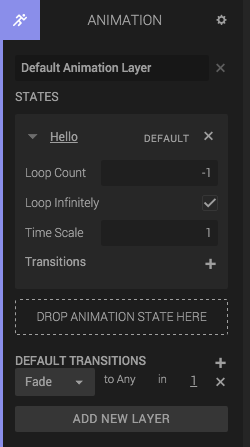

The animation component controls the animations of an imported 3D mesh. It contains a list of *animation states* and *transitions*.

## Adding an Animation component

When you import your model from your favorite 3D modelling tool into Create, you get a Geometry Component as well as an Animation Component.

## Animation States

The Animation State contains information about an animation, such as how many times it should loop, how fast it should run, and if it has any transition. If there's no transition for an AnimationState, then the Default Transitions at the bottom will be used.

## Transitions

If you want to switch between animation states, but want the transition between them to be smooth, then you add a Transition. The transition can be Fade, SyncFade or Frozen.

### Fade

A transition that blends over a given time from one animation state to another, beginning the target clip from local time 0 at the start of the transition. This is best used with two clips that have similar motions.

### SyncFade

A transition that blends over a given time from one animation state to another, synchronizing the target state to the initial state's start time. This is best used with two clips that have similar motions.

### Frozen

A two state transition that freezes the starting state at its current position and blends that over time with a target state. The target state moves forward in time during the blend as normal.