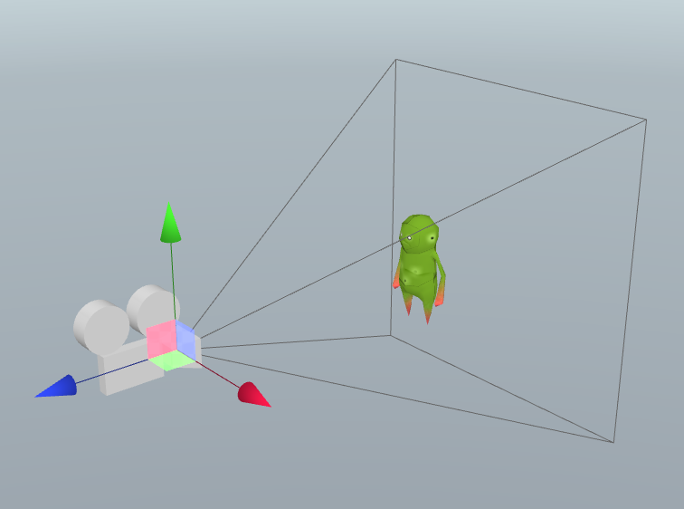

The Camera Component adds a camera to your entity. In Create, you can use it to define your 3D viewport.

### Main Camera

If the camera is set to be the *Main Camera*, then the scene will get rendered through this camera when the scene starts. If you have multiple cameras, you can switch between these during both edit- and playback mode.

### Follow Editor Camera

If this checkbox is checked, the camera will automatically set its position to the editor camera position. This is useful when switching between play and edit mode.

### Projection: Perspective or Parallel

This setting controls how the camera will project the 3D world on the 2D canvas.

### FOV: Field Of View

This value is the number of degrees from left to right that the camera will span.

### Clipping planes: Near and Far

These numbers define where the clipping of the camera frustum will occur. Try to keep this range as small as possible to make sure to get good precision.

### Debug rendering

When an entity has a camera component, it gets a debug render of the camera and its frustum while in edit more:

