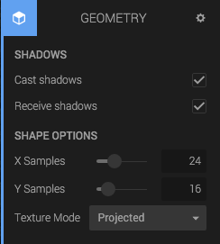

The *Geometry* panel contains a renderable mesh or primitive on the entity. When you import a 3D model, or create a primitive from the *Create Entity* dialog, it will always get a Geometry component.

Together with a Material component, the Geometry can be rendered. If you don't have a Material component, the geometry will be invisible.

The panel looks different for different kinds of meshes and primitives, but in general, they have these settings:

* Cast shadows
* Receive shadows
* Dimensions and/or number of samples (primitives only)

