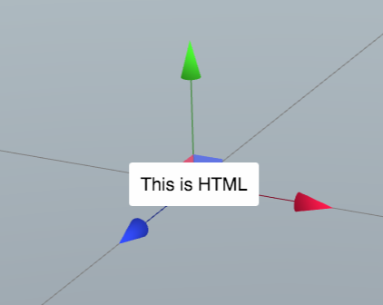
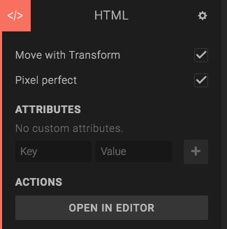
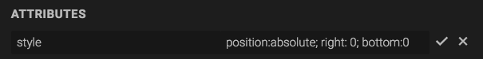

The *HTML Component* adds a 2D DOM element to the entity, and lets you edit its HTML contents using the Script editor. You can position the component using the entity transform, or use CSS to position it relative to the viewport.

## Move with transform

If you check this checkbox, the HTML component can be positioned using the transform component, or gizmos in the viewport. This is useful when you want to make a label on a 3D object in your scene, for example.

If you uncheck *Move with transform*, the component will be positioned according to the CSS rules it has. You can add CSS in the script editor.

## Pixel perfect

The "pixel perfect" option allows you to snap the HTML component to the closest pixel position.

## Attributes

If you want to add some HTML attributes to the DOM element container, add these here. This can be useful for positioning, for example. If you want to set the position to the bottom right corner, you can do this:

Note that other attributes on the DOM element will be overridden by the attributes you add here.

## Edit in script editor

Click the *Open in Editor* button to open the HTML editor for the component. This lets you edit the HTML contents.

This is the HTML used for the HTML component shown in the screenshot above.



    This is HTML

