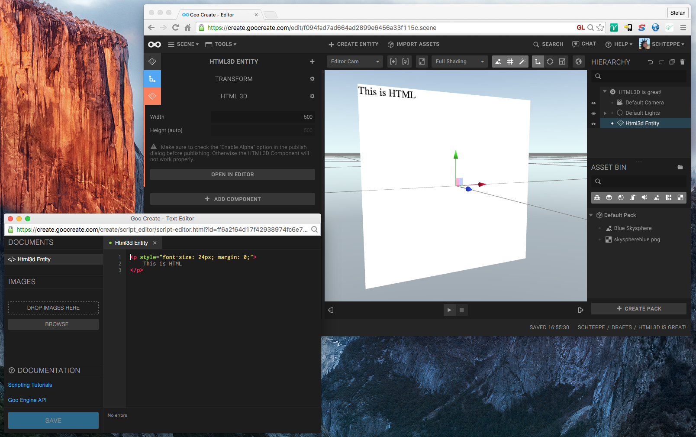
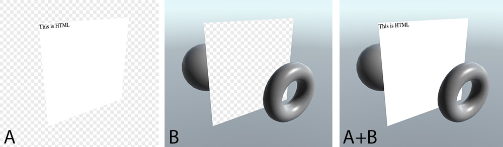

The HTML 3D entity lets you mix 3D DOM elements and WebGL easily. The embedded DOM element behaves like a Quad in 3D space and you can edit its content in the Script editor.

## Width

The component has a single setting, and that is the width. Goo Create uses this parameter to scale the HTML contents. The number is the number of pixels that should fit into the 3D quad along the X axis.

## Technique and limitations

The technique behind the HTML 3D component is as follows. The WebGL canvas is put in front of a DOM element, which is transformed using CSS3D. Inside the WebGL scene, there's a Quad that masks the Canvas, so that the DOM element behind the canvas is visible through. Synchronization of the WebGL and CSS3D transforms is done by Goo Engine internally.

The most prominent limitation is that you cannot use transparency in your HTML. Since there's nothing behind the 3D DOM element, you will see empty background behind it.