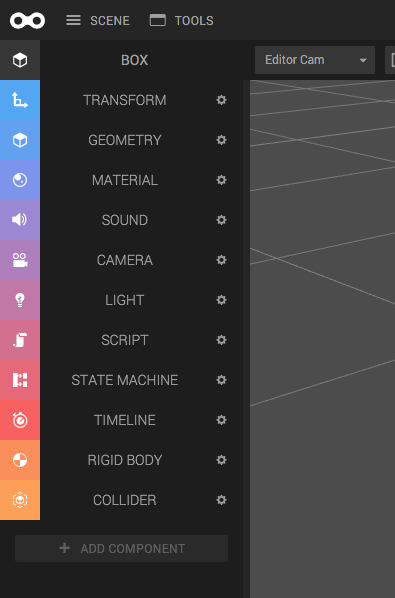
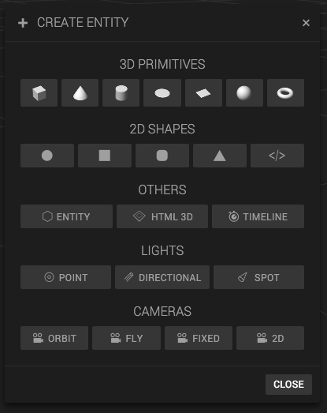
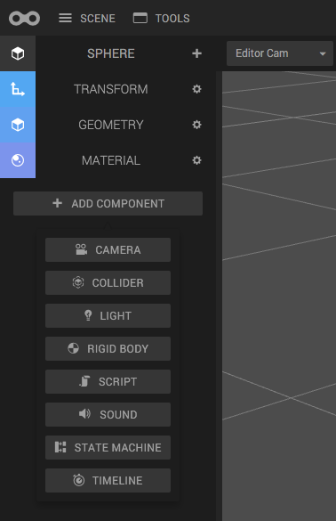
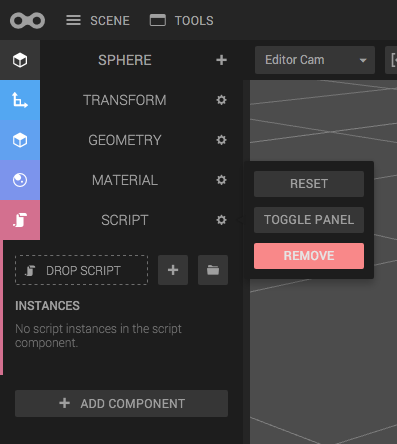

An entity is a container of components. Each component adds some functionality to an entity. For example, when a transform component is added to an entity, the entity has a position in the 3D world. If a camera component is added to the same entity, we now have a camera with a position. If a Geometry component and a Material component are added to an entity, it's now a 3D model we can render.

There are many types of components built into Create. See the following sections for more information about them.

The Box entity above has many components. If you click the component name, the panel will expand, and you can configure your component. Each component also has a little cog wheel on it, which contains more options.

## Creating a typical entity with pre-added Components

To make it easier for you to add entities, all entities have a Transform Component by default.

If you open the *Create Entity* dialog (see button at center top in Create), you can create typical entities with some more pre-added components. For example, you can add a Point light (which is an entity with a light component and a transform component) or a fixed camera (transform component + camera component).

## Adding a component

Adding more components to an entity is easy. Click the *Add Component* button in the Inspector and choose component type. The component will be added with default settings.

## Removing a component

To remove a component from the entity, click the cog wheel on the component panel, and then click remove.

Note that some components cannot be removed, for example the Transform Component.

