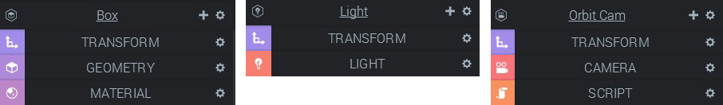
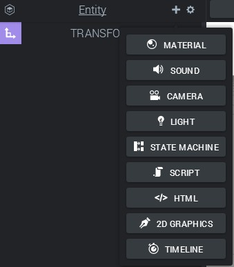
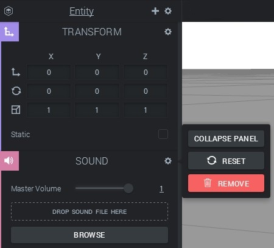

Entities and Components are the two fundamental building blocks in the Goo World. Goo Engine uses them at a core level, and the interface of Goo Create approximately reflects their relationship as well.

<h2>An Entity is a Container</h2>
The absolute easiest way to look at an entity is like a container. A shell, which on its own has no functionality. An empty entity does nothing a all! Yet, everything we can see, hear or interact with in Goo Engine is an entity. How is that? The answer lies in the components.

<h2>Components Represent Functionality</h2>
An entity is a container. A container of components. Each type of component brings a specific functionality to an entity! For example, when a transform component is added to an entity, the entity has a place in the 3D world! If a camera component is added to the same entity, we now have a camera! If a meshdata and a meshrenderer component are added to an entity, it is now a 3D model we can render, and so on. In Goo Engine, every type of functionality is implemented in terms of components. We are actually allowed to create any combination of components we like!

<h2>Entities and Components in Goo Create</h2>
<h3>Presets</h3>
To make things easy, there are shortcuts to create entities with a pre-defined set of components. For example, when we create a camera, we get a transform, a camera, and (possibly) a script component. The script component comes with different types of scripts depending on what type of camera we added. If we create a light, it will have a transform and a light component. A box will have a transform, some geomety and a material, and so on. The component panels are visible in the left-hand <strong>Inspector</strong> panel.

Adding entities from the Create menu gives us presets of component combinations.<em>  </em>

<h3 style="text-align: left">Adding Components</h3>

The presets in the Create menu are just shortcuts, as we've already mentioned. There is nothing special about a "light entity" except for the fact that it happens contain a light component. It can easily be turned into anything else, like a monster-generating and heavy-metal-blasting script entity. Adding components to an entuty is easy, we just click the plus sign next to the entity name to get a list of components we can add. This list may very well change in the future as more features are added to Create! Note that <em>all entities in Create get a transform component by default</em>. It's such a fundamental component, so it makes a lot of sense to have it that way.

Adding components

After a component has been added to an entity, the panel can be expanded. Each component panel will have its own set of features and controls. In the example below, we have added a sound component to an entity and expanded both the transform and the sound panels. Also note that a component can be reset (all its values set to default) or deleted throgh the gearbox icon.

Expanded component panels in the Inspector

<h2>Behind the Scenes</h2>

Deep within Goo Engine, the components are handled by corresponding system. The short way to say this is that each type of component has a system that keeps track and takes care of all components of that type (and nothing else)! The slightly longer, but still short, version can be read about in the <a href="http://goolabs.wpengine.com/learn/goo-engine-architecture-overview/" title="Goo Engine Architecture Overview" target="_blank">Architecture Overview</a> article!
