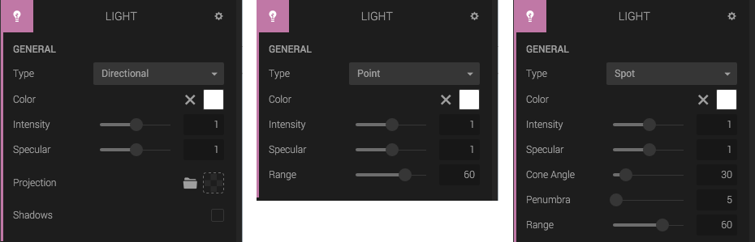
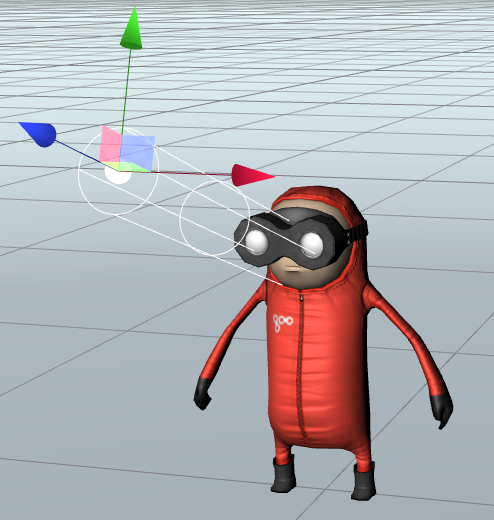
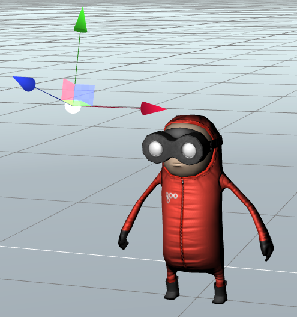
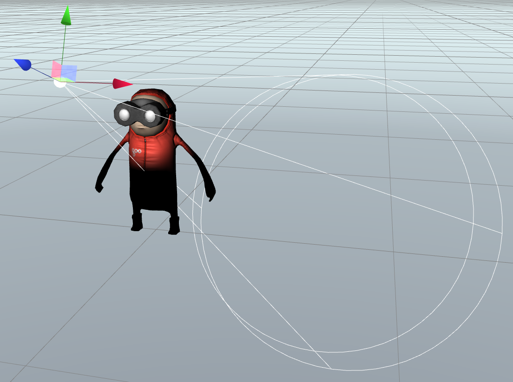

The Light Component adds a light source to the entity. The built in light types are *Directional light*, *Point light*, and *Spot light*.

All lights have the following properties:

* Color: The color of the light.
* Intensity: The intensity of the light (typically between 0 and 1).
* Specular: The intensity of the specular light (typically between 0 and 1).

When you edit a Light Component in Create you get helpful debug rendering.

## Directional light

A light that shines from a specific direction, not from a specific position. This light will behave as though it is infinitely far away and the rays produced from it are all parallel.

Properties:

* Projection: a texture to project with the light.
* Shadows: Check to enable shadow casting from this light.

If shadows are enabled, you get the following options:

* Resolution
* Darkness
* Type
* Size
* Range

## Point light

A point light shines in all directions from its location, within a given range.

## Spot light

A spot light is a point light that is restricted to shining in a cone shape. You can use the parameters in the Component to set the cone angle, penumbra and the range of the light.

