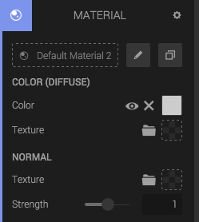


	
		
	


The *Material Component* adds a material asset to your entity. The Material Component controls how your Geometry Component is rendered. To learn more about Materials, have a look at the page for the [Material Asset]({{ materials-url }}).

