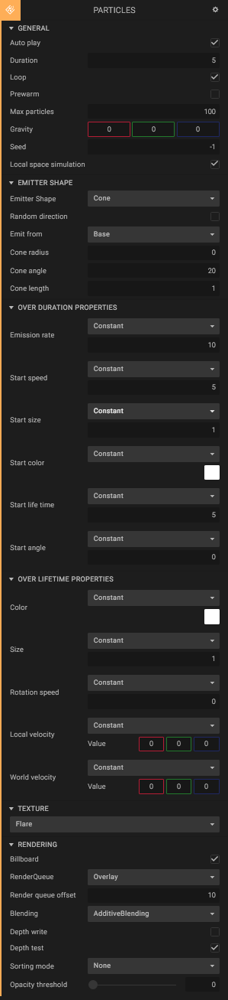

The *Particle System Component* simulates fluid entities such as liquids, clouds and flames by generating and animating large numbers of small 2D images in the scene.

## General

<table class="table">
<tr>
	<td>Auto play</td>
	<td>If true, the animation will start when the scene starts.</td>
</tr>
<tr>
	<td>Loop</td>
	<td>Whether to loop the emission animation.</td>
</tr>
<tr>
	<td>Duration</td>
	<td>The duration of the emission animation in seconds. If looping is enabled, the system will loop after this duration time.</td>
</tr>
<tr>
	<td>Prewarm</td>
	<td>Whether to prewarm the emission.</td>
</tr>
<tr>
	<td>Max particles</td>
	<td>Maximum number of visible particles at the same time.</td>
</tr>
<tr>
	<td>Gravity</td>
	<td>A constant force that affects all particles.</td>
</tr>
<tr>
	<td>Seed</td>
	<td>Randomization seed. The animation will look the same for the same seed. Set to -1 if you want randomized each time.</td>
</tr>
<tr>
	<td>Local space simulation</td>
	<td>Whether to simulate the particle system in the space of the parent entity. If false, they will be simulated in world space.</td>
</tr>
</table>

## Emitter shape

<table class="table">
<tr>
	<td>Emitter Shape</td>
	<td>Shape of the particle emitter. Depending on the shape selected, new settings for the shape appear.</td>
</tr>
</table>

## Over duration properties

<table class="table">
<tr>
	<td>Emission rate</td>
	<td>Emission rate over duration, specified in particles per second.</td>
</tr>
<tr>
	<td>Start speed</td>
	<td>Initial speed of particles, over duration.</td>
</tr>
<tr>
	<td>Start size</td>
	<td>Initial size/scale of the particles, over duration.</td>
</tr>
<tr>
	<td>Start color</td>
	<td>Initial color of the particles, over duration.</td>
</tr>
<tr>
	<td>Start life time</td>
	<td>Initial life time of particles, over duration.</td>
</tr>
<tr>
	<td>Start angle</td>
	<td>Initial angle of particles, over duration.</td>
</tr>
</table>

## Over lifetime properties

<table class="table">
<tr>
	<td>Color</td>
	<td>Particle color over lifetime. Will be multiplied with the initial color.</td>
</tr>
<tr>
	<td>Size</td>
	<td>Size (scale) of the particle over lifetime.</td>
</tr>
<tr>
	<td>Rotation speed</td>
	<td>Rotation speed (degrees per second) over lifetime.</td>
</tr>
<tr>
	<td>Local velocity</td>
	<td>Local space velocity over lifetime, specified in meters per second.</td>
</tr>
<tr>
	<td>World velocity</td>
	<td>World space velocity over lifetime, specified in meters per second.</td>
</tr>
</table>

## Texture

Here you can choose between a few (procedurally generated) texture presets, or choose an own texture asset.

## Texture animation

<table class="table">
<tr>
	<td>Texture tiles</td>
	<td>How many tiles there are in the sprite sheet, in X and Y directions.</td>
</tr>
<tr>
	<td>Cycles</td>
	<td>How many texture animation cycles to finish over a life time.</td>
</tr>
<tr>
	<td>Frame over lifetime</td>
	<td>A curve specifying when to show what frame in the animation. 0 is the first frame and 1 is the last. A linear curve starting at 0 and ending at 1 will traverse all frames in the animation.</td>
</tr>
</table>

## Rendering

<table class="table">
<tr>
	<td>Billboard</td>
	<td>Billboard mode will make the particles always face the camera.</td>
</tr>
<tr>
	<td>RenderQueue</td>
	<td>Renderqueue of the particle mesh. Note that the offset will be added to the render queue.</td>
</tr>
<tr>
	<td>Blending</td>
	<td>What kind of blending to use, for example *Additive Blending*.</td>
</tr>
<tr>
	<td>Depth write</td>
	<td>Whether to write to depth buffer or not.</td>
</tr>
<tr>
	<td>Depth test</td>
	<td>Whether to test against depth buffer or not.</td>
</tr>
<tr>
	<td>Sorting mode</td>
	<td>The sorting mode defines the draw order for the particles. If you have transparency blending, you should probably sort by camera distance.</td>
</tr>
<tr>
	<td>Opacity threshold</td>
	<td>The lower alpha threshold at which fragments will be discarded.</td>
</tr>
</table>