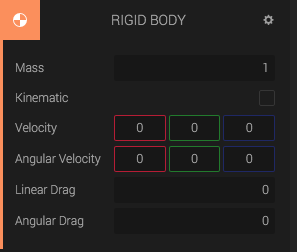
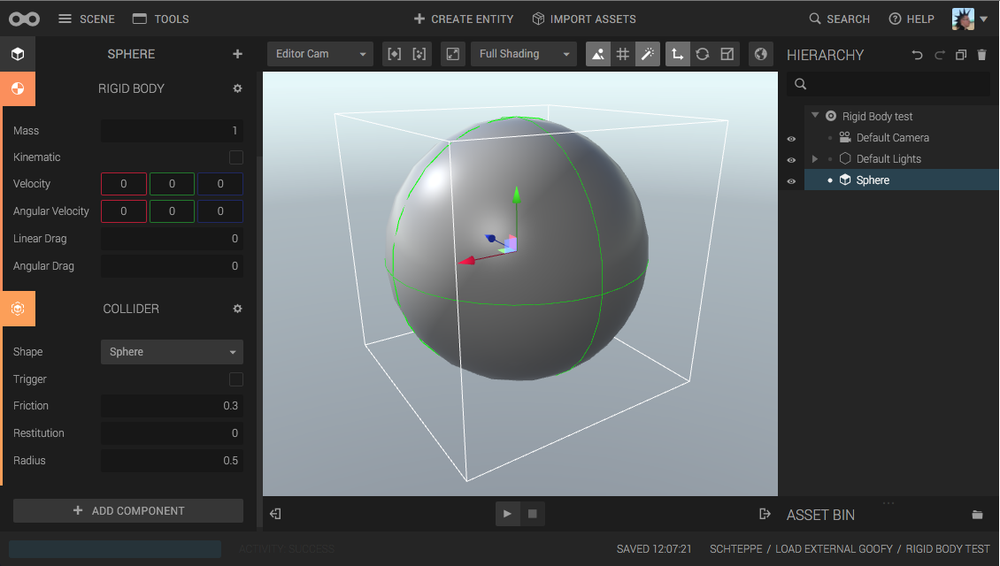

The *Rigid Body Component* adds physics properties, such as mass and velocity, to the entity. The component will simulate physics for the component and set the position and orientation of the entity accordingly.

## Adding a collider - needed for collision

If you add a *Collider Component* to the same entity, or any entity below the Rigid Body entity in the hierarchy, then the collider will be used for rigid body collision, with the center of mass being at the same location as the Rigid body entity.

## Adding many child colliders - for advanced collision shapes

## Kinematic vs Dynamic

By default, the Kinematic checkbox is unchecked. This means that the Rigid Body is *Dynamic*. A dynamic rigid body is affected by external forces, a kinematic is not.

If you set the body to be dynamic, it will fall according to gravity. If you set it to Kinematic, it will not. Same with collisions: a Kinematic body cannot be pushed by other bodies.

## Velocity

You can set the *Initial Velocity* and *Initial Angular Velocity* in the panel. This defines what velocity the body should have when you press play.

## Drag

Drag is a value between 0 and 1 that defines how much "air resistance" the body has. If *Linear Drag* or *Angular drag* is zero, then there will be no air friction. 1 is the maximum value and the body will barely move.