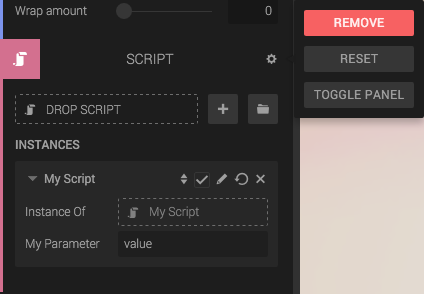

The Script component allows you to add scripts to your entity. The component can hold zero or many scripts.

## Script Instance vs Script

A Script component contains a list of "Script Instances". The instances contains a reference to a Script and some parameter values. This allows you to re-use a Script several times on the same or on different entities, but with different parameters.

## Sorting and execution order

You can sort the scripts in the panel by dragging and dropping the scripts. The execution order will be from top to bottom.

## Enabling or disabling a Script

The checkbox allows you to toggle individual scripts.

## "Instance Of"

Each script instance in the list has a reference to the script it is using. Clicking the script will take you to the scripts' own panel.

