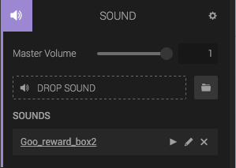
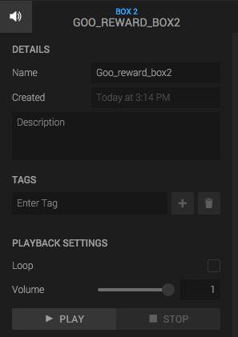

The *Sound Component* adds a number of sound assets to the entity. Note that the sound will not auto-play, but you can easily play it using scripts or the State Machine.

## Master volume

This slider controls the master volume of all sounds in the component.