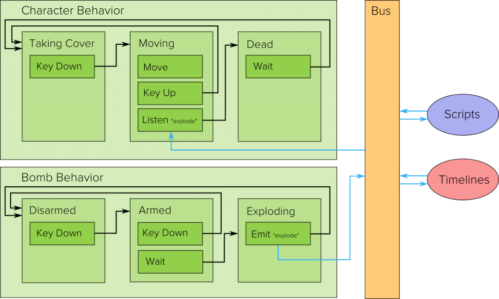

Goo Create ships with a state machine, which is one of three ways to add interactivity to your scene. The other two ways are _scripting_ and the _timeline_. Each way has its pros and cons, and there are ways to use several methods simultaneously.  

State machines are added via _State machine components_ attached to entities. State machines are good for adding interactivity without coding, and let you work with a large selection of predefined _actions_. Actions are activated when certain _states_ become active, and states are in turn are encapsulated by _behaviors_.  

  

A Goon with a state machine  

## The Building Blocks

It’s difficult to explain the state machine concepts independently, so it might be worth reading through the following explanations twice to solidify the way things are connected.  

### Behaviors

A behavior is a collection of states. If an entity’s state machine has several behaviors, they are independent of each other. That means that the transitions in a behavior will not affect the other behaviors! A behavior can be seen as and behaves like _an independent state machine_.  

### States

Each behavior can one or several states, but only one _active_ state. As long as a state is active, all its actions will also be activated. All actions in other states will be deactivated. The active state is changed by_transitions_ in the state’s actions.  

### Actions

An action is the thing that eventually gets executed when its state becomes active. There are many types of actions and their effect varies a lot, so it’s very hard to give a complete picture in a document like this. Take a minute to look through the different actions in Create, you might find something useful! In the meantime, here are some examples of actions:  

* Emit fire particles from an entity.
* Listen for and react to key presses.
* Check for and react to collisions between entities.
* Transition to another state after a certain amount of time.
* Move, scale or rotate an entity.
* Project a camera’s image on an entity’s texture.
* Select active animation.
* ...and so on!

## How To Use The State Machine

### Setting up Transitions

Equipped with all this knowledge, how does one tie it together? The key is the transitions. The standard way of working with the state machine is by wiring up a chain of states with transitions between them. For example, an easy example is moving an entity using key listeners. Each state in a “moving behavior” represents one way of moving, including not moving at all. For example, one could use three states. One for moving forward, one for moving backward, and one for standing still. The moving states would both use a “move” action with appropriate parameters, and the idle state would just be empty. Then, one could add a key listener to each of the states and wiring up the transitions appropriately, deciding how to move between the three states.  

### Using The System Bus

There is a convenient way of communicating between states, between scripts and state machines, between the timeline and scripts, and even between behaviors. By emitting and listening to messages on the system bus, any type of actions and scripts can be triggered. The state machine facilitates this by providing Emit Message and Listen actions, both capable of transitions.  

### An Example

  

Application example, explained below (click to open large image)  

The picture above shows a (simplified) little application. The idea is the following: A character can either take cover, move or be dead. If some key is pressed while the character is taking cover, the player enters the “moving” state and starts moving. If the key is released while moving, the character goes back to taking cover. If the system bus emits on the channel “explode”, the character goes into the “dead” state. Here, it waits for some amount of time and then awakes from the dead and moves into the “taking cover” state.  

The other behavior is separate, and might belong to another entity. This behavior moves a bomb between three states; disarmed, armed and exploding. The bomb can be armed or disarmed by pressing a key. If the bomb is armed long enough, it will explode and emit a message on the “explode” channel. It is up to other behaviors to listen to this message and react to it, as in the case with the character.  

Scripts and timelines interacts with the same bus. For example, one could write a script to emit the explosion at any complex combination of requirements. Another option would be to set off explosion at certain points in time using the timeline.