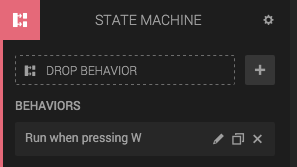
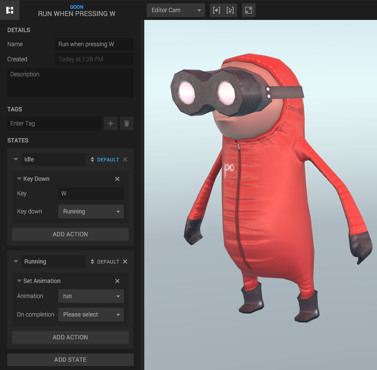
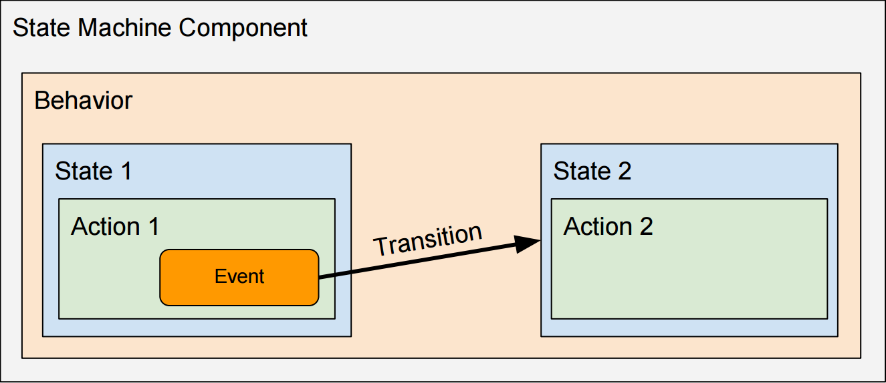
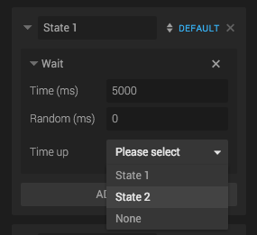

The *State Machine Component* adds simple logic to the entity, similarly to scripts. The difference from scripts is that the State machine is much easier to use (no coding required!) and have many built-in Create-specific Actions.

The State Machine Component has two main panels, the panel for the Component:

...and a panel for the Behavior:

## Structure

The State machine has a list of *Behaviors*, which contains *States*, which in turn contain *Actions*.

[Read more about Finite State Machines on Wikipedia](https://en.wikipedia.org/wiki/Finite-state_machine).

### Behaviors

A *Behavior* is a collection of states. A state machine component can have several behaviors, and they are independent of each other. A Behavior can be seen as and behaves like *an independent state machine*.

### States

Each *Behavior* has one or several *States*, but only one *active* state. As long as a state is active, all its *Actions* will also be active. All actions in inactive states are inactive. The *active state* can be changed by *transitions* in the state’s actions.

A Behavior always has one *Default State* which is activated when you press Play.

### Actions

An *Action* is some logic gets executed while its State is active. Some actions executes its logic once and are done, while others execute logic once per frame. There are also Actions that just listens for events, and executes logic when the event happens.

There are many types of Actions and their effect varies a lot. Some examples are:

* Pick: Listen for a click/touch on the entity.
* FireFX: Emits fire particles from an entity.
* KeyDown: Listen for and react to key presses.
* Collide: Check for and react to collisions between entities.
* Wait: Transition to another state after a certain amount of time.
* Move: Moves an entity.
* Set Animation: Select active animation.
* Emit: Emits an event to the System Bus.
* ...and so on!

## Transitions: How to switch State

Many of the Actions have events, and they can trigger Transitions to other states. The simplest example is probably the WaitAction. When the Action starts executing, it sets a timer for a number of seconds. When the timer is up, it can transition to some other State.

