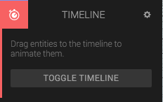
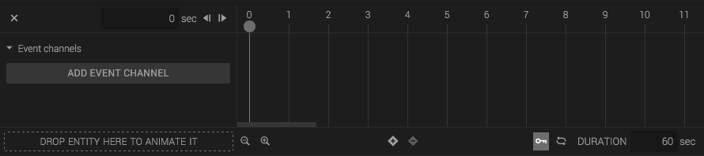
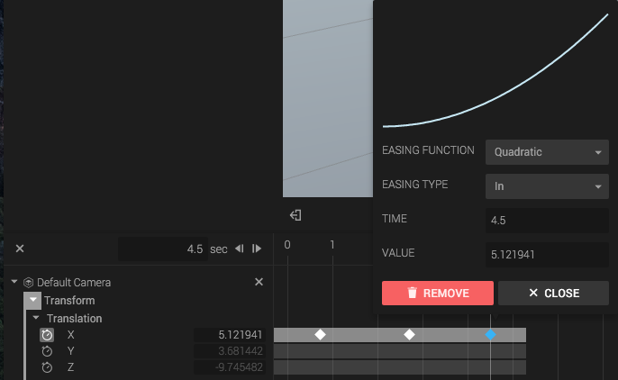

The *Timeline Component* animates properties of an entity over time, such as the transform.

When you add the Timeline Component to an entity, you'll get a component panel with just one button.

Click the *Toggle Timeline* button to open the Timeline.

## Adding entities

To add an entity to your timeline, drag it from the Hierarchy view to the drop area at the left bottom in the Timeline. The entity will appear to the left in the Timeline. View the entity properties available for animation by clicking on it. Each animateable property is called a *Channel*.

Note that you can *not* add the owner entity to the Timeline.

## Keyframes

To change a property value over time, you add *Keyframes* to a *Channel*. A Keyframe has a position on the Timeline, a value and an easing function. As time go by, the property value will be set to the value given by the keyframes, interpolated by the easing functions.

## Duration and looping

The Timeline has a start and an end. You can set the duration of the timeline and toggle looping in the right bottom corner.

## Event Channels

Event channels are used to emit SystemBus events at given points in time. Click *Add Event Channel* to add a channel for an event. You will be prompted for an event name to use.

To fetch these events, you can use [SystemBus.addListener](http://code.gooengine.com/latest/docs/index.html?c=_met_Bus_addListener) in a Script or use the *Listen Action* in the State Machine. Make sure to listen for the same event name that you specified when adding the channel.