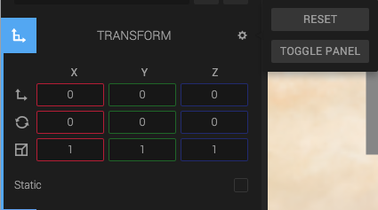

The transform component contains the local transform of the component: translation, rotation and scale. The transform is relative to its parent.

The transform panel has a *Static* checkbox, which indicates that the entity should not move and can be optimized for that.

