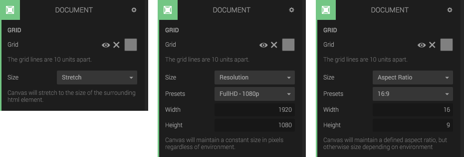

The document panel lets you configure the size of the WebGL canvas and grid color (used only in edit mode).

You have the following options:

* Stretch: stretch the canvas to its container.
* Aspect ratio: Stretch the canvas to its container, but keep the aspect ratio.
* Resolution: Set a fixed size of the canvas.