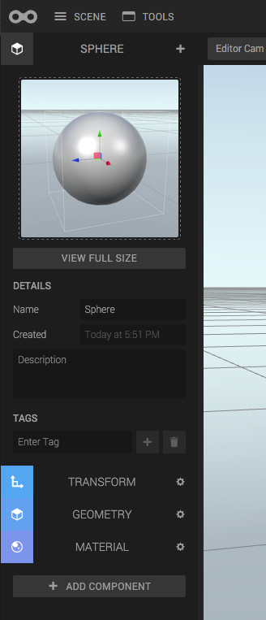

An entity is on its own nothing but a container of Components. The components extend the entity with functionality. For example, a TransformComponent gives the entity a position, rotation and scale in 3D space.

When an entity is selected in Create, the Inspector shows the entity and its components.

At the top, the entity name and metadata can be viewed and edited. At the bottom, all the components of the entity are listed. Click a component to expand its panel.

To add a component, click the plus button at the top, or the "Add component" button at the bottom. To remove a component, click the cog wheel button on the component and then *Remove*.

## Tags

The tags are a special kind of meta data that you can use in scripting. A tag is a string of letters, and you can get all entities with this tag by running the following in a script:


var entities = ctx.world.by.tag('myTag');
