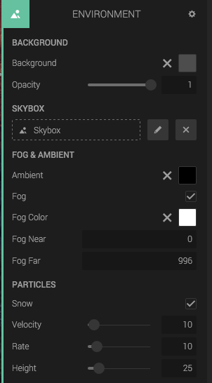

## Background

The *Background* part lets you set the color of the background in your scene, of which is a grey by default.

The *opacity* only influences published projects. If you embed the scene on your site, elements behind the goo canvas can be seen through.

## Skybox

A skybox can be described as a infinitely large box (or sphere), that you only see the inside of. You can drop any Skybox here, or click the + button to create a new one. Click the drop area or the edit button to edit the Skybox.

## Ambient

This is the global ambient light for the scene. Note that it will not have any effect on the skybox/skysphere.

## Fog

Enable the fog using the checkbox, and color and range inputs will appear. 

*Fog Near* and *Fog Far* is where the fog should start and end, measured in distance to the camera. If the camera is closer than *Fog Near*, you will see no fog, and full fog if it's more distant than *Fog Far*.

## Particles

Enable snow particles using the checkbox, and the snow settings will appear.

* *Velocity* controls how fast the snow particles will fall.
* *Rate* controls how many particles per time unit.
* *Height* controls at what height the particles will spawn, relative to the camera height.