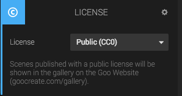

The License panel can be used to set the scene to Public or Private. If you set it to Public, then anyone with the link can duplicate your project. If you set it to Private, then only you or users you share the scene with, or users in the same organization, can open the scene.

