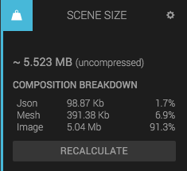

The Scene Size panel gives you a hint about how much data your scene is using. You can see the number of kilobytes from JSON, mesh data and binaries.

Note that if you serve the scene using gzip (which is done if you publish your scene in Create), then the data will be compressed and use less network traffic. To get the true amount of data transferred over the network, we suggest that you open your scene in Google Chrome and use Chrome Devtools to measure (open the Network tab).