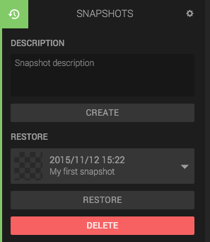

The Snapshots panel lets you create a copy of your scene that you can restore later. This is useful when doing experimental changes to the scene.

## Creating a Snapshot

Fill in a Snapshot description and click *Create*. Your snapshot is saved.

## Restoring a Snapshot

Pick a snapshot from the drop down list, and click *Restore*. Your scene will be restored to that snapshot.

## Deleting a snapshot

Pick a snapshot from the dropdown list and click *Delete*. Your snapshot will be deleted. Warning: You cannot undo this.