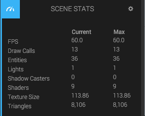

The *Stats panel* gives you some stats about the current scene relating to performance.

<dl class="dl-horizontal">
	<dt>FPS</dt>
	<dd>Frames per second.</dd>
	
	<dt>Draw Calls</dt>
	<dd>The number of draw calls done per frame. For performance, try keeping this number down.</dd>

	<dt>Entities</dt>
	<dd>The number of entities currently in the viewport.</dd>

	<dt>Lights</dt>
	<dd>The current number of lights in the scene. Try keeping this number down for performance.</dd>

	<dt>Shadow casters</dt>
	<dd>The number of shadow casters in the scene.</dd>

	<dt>Shaders</dt>
	<dd>The number of shaders. Try keeping this number down.</dd>

	<dt>Texture Size</dt>
	<dd>Current texture size in the GPU.</dd>

	<dt>Triangles</dt>
	<dd>Current number of rendered triangles.</dd>
</dl>